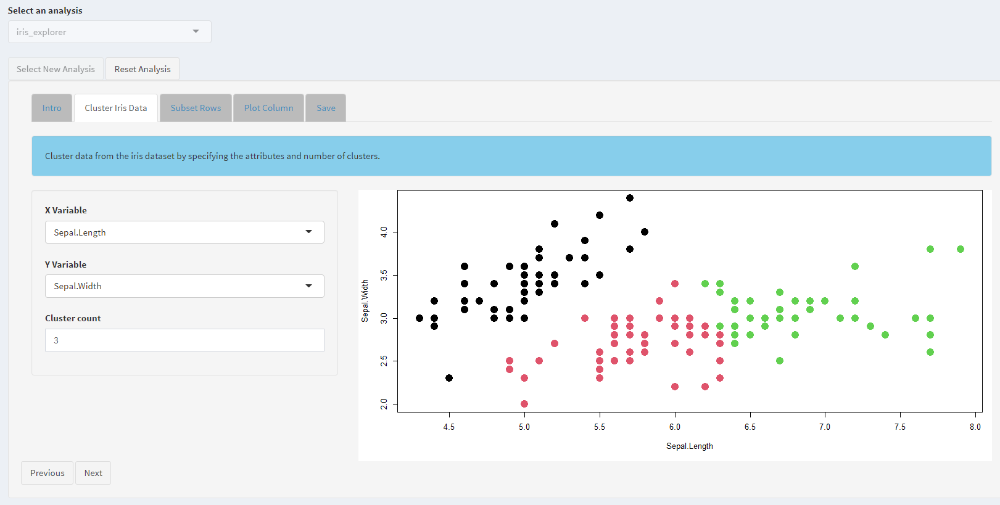
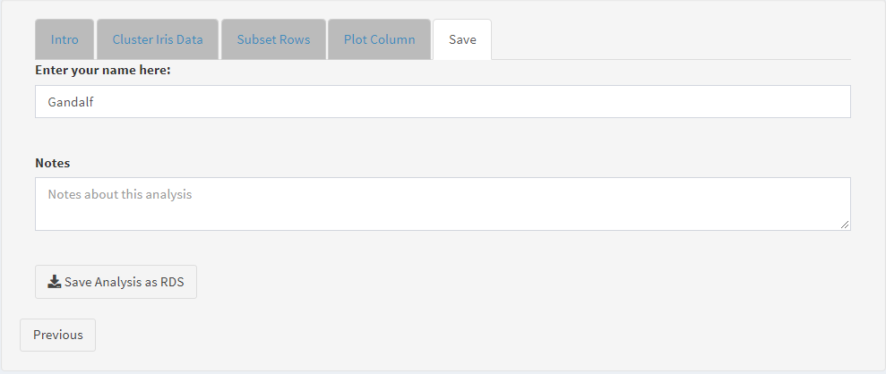

```{r setup, include=FALSE}
source('www/includes.R')
```

## {width=50px} Introduction

As we've seen in previous tutorials, creating well-documented apps is a core feature of *shinymgr*. An "analysis" is the product of running an app built with *shinymgr*. As we'll see in this tutorial, analyses can be saved as an RDS file, and the saved analysis can be used to view the results, populate report templates (see next tutorial), and even reproduce the analysis. We'll begin this tutorial by walking through how to run an analysis, then delve into what gets saved when an analysis is complete. We'll conclude by showing how the saved analysis can be used to re-run an app and validate the analysis results, and how you can restore an old analysis should things go wrong.

## Running a new analysis

At this point, we've used the "App Builder" to create the "Iris Explorer" app.  Once you restart *shinymgr*, your app will appear on the list of available analyses in the "New Analysis" tab. We illustrated the process in the previous tutorial.  After choosing an analysis from the drop-down, press "Select New Analysis" to launch the app. The first step to running an app will always be to press the "Start New Analysis" button (this allows Shiny to properly render the app's UI). Use the "Next" button to navigate through each tab in the app until you reach the "Save" tab.

```{r fig1,  echo = F, out.width = "100%", fig.cap = "*Figure 1.  All shinymgr apps consist of a set of tabs that are worked through in order.*"}

```

Hopefully you remember the flow of the "iris_explorer" app.  The first tab features the "iris_intro" module.  The second tab features the "iris_cluster" module. The third tab features the "subset_rows" module.  The fourth tab allows the user to plot selected columns, and features the "single_column_plot" module.  The final tab allows you to save the analysis.

## Saving an analysis

```{r fig2,  echo = F, out.width = "100%", fig.cap = "*Figure 2. The final tab of a shinymgr app is the 'Save' tab.*"}

```

The "Save" tab is the final tab of any *shinymgr* app. It allows a user to enter their name, add some comments, and download the analysis to their default "Downloads" folder as an .RDS file with the naming convention `appName_user_date.RDS`. An RDS file is an R file that stores a single object. It can be read back into R with the `readRDS()` function.

>&#128073;&#127996; What exactly is downloaded? The answer is almost everything, and it is stored as a list.

Let's take a look at the example saved analysis that comes with the *shinymgr* package (the example is also included in the "analyses" folder of the demo *shinymgr* project). First, we'll get the file path to the analysis and load the RDS file:

```{r}
analysis_path <- paste0(
  find.package('shinymgr'), 
  '/shinymgr/analyses/iris_explorer_Gandalf_2023_06_05_16_30.RDS'
)

analysis_demo <- readRDS(analysis_path)
```

Next, we'll take a look at the different named elements of the saved analysis list:

```{r namesdemo}
names(analysis_demo)
```

> &#128073;&#127998;Reproducibility is a core tenet of *shinymgr*, so therefore a robust suite of features are saved to allow a user to open an analysis file at any point in the future and be able to both understand and (hopefully) replicate their results. 

The list stores a lot of info, which we'll briefly summarize:

* **analysisName** is the name of the analysis and is equivalent to the filename of the .RDS file (without the extension)
* **app** is the name of the app that produced the saved analysis results.
* **username** was entered in the "Save" tab when the analysis was performed.
* **mod#-value** attributes with this format indicate Shiny input values at the time the analysis was saved. More on these later.
* **returns** includes the values of all outputs (returns) of each module.
* **notes** were entered in the "Save" tab when the analysis was performed.
* **timestamp** is the date/time when the analysis was saved.
* **metadata** includes robust information about each module and any package dependencies. More on this later.
* <B>*_code</B> attributes with this format contain the source code for the app. More on these later.

Most of these features are straightforward, but we will dive into some more complex variables beginning with the "mod" features. This special class of features capture the inputs that may be changed by the user through the UI. This includes the values of selectInputs and numericInputs, the number of times an actionButton is clicked, or the rows selected in a dataframe. Let's take a look at these features from the iris explorer analysis we just loaded:

```{r}
# find which list elements contain the word "mod"
indices <- grepl('mod', names(analysis_demo))

# look at the structure of these list elements       
str(analysis_demo[indices])
```

The mod2 list elements include mod2-ycol, mod2-xcol, and mod2-clusters. These correspond to the two columns selected in the "irisCluster" module ("Sepal.Length" and "Petal.Length"), and the selected number of clusters (3). Several list elements that begin with mod3-subset_table__reactable all relate to things a user might do to interact with tables rendered by the `reactable` package. All together, the values of "mod" features should allow one to reproduce the analysis results (with some exceptions, such as cases where random number generators are used).  

Another useful list element named "metadata" is returned with a saved analysis. Let's take a high-level look at the metadata for our iris explorer example:

```{r}
str(analysis_demo$metadata, max.level = 2)
```

The "metadata" list element contains information about the app itself, starting with an app description at the top level. Then, for each module, all inputs (arguments) and outputs (returns) are stored. Finally, all package dependencies are stored in the list element named "lockfile". This information is equivalent to the *shinymgr* database's "modFunctionArguments", "modFunctionReturns", and "modPackages" tables, but grouped in a way that is easy to read and easily parsable to facilitate an automated approach to interpreting an analysis. 

>&#128073;&#127998; In this way, all information that was originally stored in a **shinymgr** database by the developer get carried along through an analysis that is executed by an end-user.  

A complete accounting of package dependencies for the app are included from a "lockfile" built from all dependencies from the modPackages table (including *shinymgr* itself). This lockfile can be used to recreate the R package environment that was in use when the app was created and contains two elements: (1) The R version and (2) a recursive list of package names, version numbers, and sources for all dependencies. 

Note that dependencies in the lockfile are included recursively (except for R's base packages). For a simplified, non-recursive list of dependencies for each module, the `lapply()` function can be used to extract the package dependencies from the "modPackages" table directly.

```{r}
# look at all packages used in the analysis
lapply(analysis_demo$metadata[grep('mod', analysis_demo$metadata)], "[" , "modPackages" )
```

The result shows that the "iris_explorer" depends on the *stats* package for module 2, the *reactable* package for module 3, and *ggplot2** for module 4.


At this point, we've seen that a saved analysis provides information about the overall app, the modules themselves and their package dependencies, the selected inputs and outputs, and the meaning of those inputs in context with the rest of the app. 

> &#128073;&#127995;To complete the reproducibility cycle, analyses also store the source code of the app that was used to perform the analysis. This ensures that if an app is deprecated, or simply uninstalled, the analysis file alone is sufficient to re-run the analysis (with the important caveat that the R package dependencies are available to the user). 

The code below (not run) shows how simple it is to retrieve the app's code, and similar can be done for each of the modules that app uses:

```{r eval=FALSE}
cat(analysis_demo$app_code)
```

Since the Iris Explorer app's code contains over 200 lines, we've suppressed the output from the above code block that displays the app's source code. Similarly, the source code for all of the modules that comprise the app are also saved with the analysis. In the next section, we'll discuss how you can re-run a previous analysis.

## Re-running analyses

Re-running an analysis is made simple with the built-in *shinymgr* function `rerun_analysis()`. The function accepts a single argument that defines the file path to a saved *shinymgr* analysis (RDS file). This function will launch a shiny app, so can only be run during an interactive R session in which no other shiny apps are running. Before we look at this app, we'll briefly define it's two tabs:

The first tab is called "The App" and will be visible when the re-run function is called. It contains a header with the app's name and a subheading of "Analysis Rerun". Below that, a disclaimer appears, indicating the app was produced from a saved analysis. 

The second tab, called "Analysis Summary", simply displays the structure of the saved analysis, excluding any saved source code. The structure of the analysis gives a high-level summary, including the values that can be entered in the app to reproduce results. 

Let's see what re-running our saved analysis looks like. You may need to scroll down using the vertical scroll bar in the rendering below to see that below this disclaimer is a fully functioning, identical copy of the shiny app used to generate the saved analysis. 

```{r, warning=FALSE}
# reproduce the analysis
shinymgr::rerun_analysis(analysis_path)
```

> &#128073;&#127997; A few important things to note:  **First**, the app displayed in the "The App" tab is the original app including default values. To fully recreate the analysis in this tab, the user will need to set the shiny inputs to values that are registered in "Analysis Summary" tab.  **Second**, within the rendered app, the "Save Analysis" tab won't work in this *learnr* tutorial, but will work when you actually use the `rerun_analysis()` function outside of this tutorial. This allows the editing of a previously run analysis.

## Restoring analyses

One source of potential difficulty in rerunning an app is ensuring the correct dependencies are installed and available. Conflicts in long chains of package dependencies can be notoriously difficult to diagnose and resolve.  If a user is unable to successfully use the `rerun_analysis()` function, they can try *shinmgr*'s `restore_analysis()` function.  This function leverages the `renv` package to recreate a stand-alone R project that includes the **full R package environment** used at the time the app was made. 

```{r, eval=FALSE}
# reproduce the analysis
shinymgr::restore_analysis(analysis_path)
```

If you are unfamiliar with the *renv* package, this overview by Kevin Ushey provides a nice introduction:  https://rstudio.github.io/renv/articles/renv.html

If all goes as expected, the `restore_analysis()` function will have created a subfolder in the user's current working directory named something along the lines of "renv_iris_explorer_Gandalf_2023_06_05_16_30.Rproj".  Included in this directory is the saved is saved analysis (RDS file) and an R script called "restore_analysis_script.R" that simply contains a call to `shinymgr::rerun_analysis()`.  Also included in this directory is a subdirectory that includes (hopefully) all of the packages specified in the analysis's lockfile. Activating this project will make the new environment's packages available to be loaded and used. The saved analysis can then be rerun, as shown previously:

```{r, eval=FALSE}
# reproduce the analysis
shinymgr::rerun_analysis("renv_iris_explorer_Gandalf_2023_06_05_16_30.RDS")
```

Unfortunately, restoring the environment will not always be initially successful. Package management can be notoriously challenging, and while `renv` represents the best available tool for package management in R, ["renv is not a panacea for reproducability"](https://rstudio.github.io/renv/articles/renv.html#caveats). A package's source may change, its instillation may fail, or its source may never be known to begin with. Remedying these types of issues may require manually removing dependencies from the lockfile and/or installing dependencies individually (potentially taking advantage of the "cellar" option in renv). But the lockfile provides the most comprehensive documentation available to restore an environment capable of executing a *shinymgr* app.

## Tutorial summary 

We've continued with our iris example, showing how to save an analysis, reviewing the components of a saved analysis, and then demonstrating how a saved analysis an be re-run and possibly restored if things go awry. This chapter is essential to understanding how *shinymgr*  ensures reproducible results. 

>&#128073;&#127996; If you’d like a pdf of this document, use the browser “print” function (right-click, print) to print to pdf. If you want to include quiz questions and R exercises, make sure to provide answers to them before printing.

## What's next

You're finished! In the next tutorial, we will show how to produce Rmarkdown or Quarto report templates that take in these analyses RDS files to generate a formatted document suitable for distribution. 

```{r, eval = FALSE}
learnr::run_tutorial(
  name = "reports", 
  package = "shinymgr"
)
```


