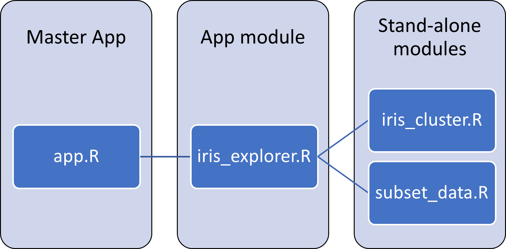

```{r setup, include=FALSE}
source('www/includes.R')
```

## {width=50px} Introduction

In the previous tutorial, we turned the k-means cluster app (https://shiny.posit.co/r/gallery/start-simple/kmeans-example/) into a module, which was then placed in a master app.

The resulting master app still has the same functionality, allowing users to select two columns (X Variable and Y Variable) from the iris dataset, and indicate how many clusters are desired.  The output is a scatterplot that shows the two variables by cluster.

<p class=instructions>
Choose two columns from the iris dataframe, and select the number of clusters desired.
</p>

```{r, echo = FALSE}
 fluidPage( 
  
  # add a title with the titlePanel function
  titlePanel("Master App"),
  
  # add the iris_cluster_ui
  iris_cluster_ui(id = "iris_cluster")

)
  
```

```{r, context = "server"}
iris_cluster_server(id = "iris_cluster")
```


It may not be a noticeable benefit when you only have one module in an app, but modularizing shiny apps allows these parts to be reused in other apps. However, as with other functions, each module has its own local scope and variables defined within the module are not accessible to other modules *unless they are returned by the producing module and passed in as arguments to the consuming module*.

In this tutorial, we will learn how to connect two modules into an app called "iris_explorer" that establishes an ordered analysis workflow. 

> &#128073;&#127996; The "iris_explorer" app is shown below; note there are two tabs. The first tab is named "K-means clustering", which calls the "iris_cluster" module, while the second tab is named "Subset Rows" tab, which calls a new module called "subset_rows" (we will create this module in another section).  The ordering of tabs establishes an implied workflow: In tab 1 we will select two columns and cluster the iris dataset, and then in tab 2 we will subset the resulting dataframe.  

<p class=instructions>
Instructions: On tab 1, choose two columns from the iris dataframe, and select the number of clusters desired.
On tab 2, select the number or rows to subset by. Press the "Re-sample" button to obtain a new random sample.
</p>


```{r, echo = FALSE}
fluidPage(
  
  # we keep the header from earlier
  h1("Master App"),
  
  # each module will have its own tab
  tabsetPanel(
    
    #k-means clustering tab
    tabPanel(
      title = "K-means clustering",
      iris_cluster_ui("iris")
    ),
    
    #subset rows tab
    tabPanel(
      title = "Subset Rows",
      subset_rows_ui("subset")
    )
  )
)

```

```{r, eval = TRUE, echo = FALSE, context = "server"}
  
 # store the output from the iris_cluster module 
  data1 <- iris_cluster_server("iris")
  
  # call the server function, setting the reactive return as the input
  data2 <- subset_rows_server("subset", dataset = data1$returndf)

  
```

Four R scripts are in play here.  First, within the working directory is the master app script ("app.R"), which contains the overall shiny framing.  Second, The "iris_explorer" app is a module ("iris_explorer.R"), and will be embedded in the Master App.  The "iris_explorer" module in turn calls the two modules ("iris_cluster.R" and "subset_data.R") that make up the tabbed workflow.

```{r, eval = FALSE}
|-- working directory
|    |-- app.R
|    |-- iris_explorer.R
|    |-- iris_cluster.R
|    |-- subset_data.R
```


To create the "iris_explorer" app, we will make the following modifications:

1. For the first tab, we will modify the "iris_cluster" module to output a dataframe that includes the two selected columns, along with a column that provides the cluster assignments for each row. This dataframe will be named "returndf".
2. For the second tab, we will  create a new module called "subset_rows".  This module will accept a dataframe as an argument (such as "returndf") and allow a user to specify how many random samples should be drawn from this dataframe; the module will return the randomly sampled rows. 
3. These two modules will then be incorporated into a new module called "iris_explorer.R".  **In *shinymgr*, this is referred to as an "app" module - it is a module that combines other stand-alone modules into an analysis workflow.**
4. The "iris_explorer" app will be summoned by the master app. 

>  &#128073;&#127998; There is a natural hierarchy of module calls in *shinymgr*. The master app is at the highest level.  Then, an "app" module such as iris_explorer is called, which stitches together multiple modules as a tabbed workflow.  At the lowest level are the individual, stand-alone modules. 

```{r fig1,  echo = F, out.width = "100%", fig.cap = "*Figure 1.  The shinymgr hierarchical structure.*"}

```


## The original iris_cluster module

Step 1 is to modify the iris_cluster module.  As a friendly reminder, the original code is posted below.  Remember, this is an R script called "iris_cluster.R" that you created in a previous tutorial.

Recall the the module includes both a UI function (called `iris_cluster_ui`) and a paired server function (called `iris_cluster_server`).  


```{r , eval = F}
iris_cluster_ui <- function(id){
  # create the module's namespace 
  ns <- NS(id)
  
  # create tagList of inputs
  tagList(
  
    sidebarLayout(
      
      sidebarPanel(
          
        # add the dropdown for the X variable
        selectInput(
          ns("xcol"),
          label = "X Variable", 
          choices = c(
            "Sepal.Length", 
            "Sepal.Width", 
            "Petal.Length", 
            "Petal.Width"),
          selected = "Sepal.Length"
        ),
        
        # add the dropdown for the Y variable
        selectInput(
          ns("ycol"), 
          label = "Y Variable", 
          choices = c(
            "Sepal.Length", 
            "Sepal.Width", 
            "Petal.Length", 
            "Petal.Width"),
          selected = "Sepal.Width"
        ),
        
        # add input box for the cluster number
        numericInput(
          ns("clusters"), 
          label = "Cluster count", 
          value = 3, 
          min = 1, 
          max = 9
        )
        
      ), # end of sidebarPanel
      
      mainPanel(
        
        # create outputs
        plotOutput(
          ns("plot1")
        )
        
      ) # end of mainPanel
      
    ) # end of sidebarLayout
    
  ) # end of tagList
  
} # end of UI function

# ---------------------------------------------------

iris_cluster_server <- function(id) { 
  
  moduleServer(id, function(input, output, session) {
    
  ns <- session$ns
  
  # combine variables into new data frame
  selectedData <- reactive({
    iris[, c(input$xcol, input$ycol)]
    })
  
  # run kmeans algorithm 
  clusters <- reactive({
    kmeans(
      x = selectedData(), 
      centers = input$clusters)
    })
  
  output$plot1 <- renderPlot({
    oldpar <- par('mar')
    par(mar = c(5.1, 4.1, 0, 1))
    p <- plot(
      selectedData(),
      col = clusters()$cluster,
      pch = 20, 
      cex = 3)
    par(mar=oldpar)
    p
    })

  }) # end of moduleServer function
  
} # end of iris_cluster function
```

Note that this module does not return anything; the plot is rendered but the locally defined variables **selectedData()** and **clusters()** are unavailable to other modules.

## Modifying the iris_cluster module

As mentioned earlier, we will modify the "iris_cluster.R" module slightly so that the module outputs (returns) a dataframe that can be passed onto other modules (as arguments). This dataframe will include the two selected columns from the iris dataframe, plus an additional column that provides the cluster number for each row.  To do this, we don't need to modify `iris_cluster_ui()`, only `iris_cluster_server()`. If you are following along, the changes are shown below and can be copied to update "iris_cluster.R".

First, we will create the dataframe that will be returned. The function `reactive()` will establish this as a reactive object.  Second, we will use the `return()` function to explicitly return a list of reactive objects via the `reactiveValues()` function.  The changes are highlighted in pink below (feel free to copy the code):

```{r, eval = F}
iris_cluster_server <- function(id) { 
  
  moduleServer(id, function(input, output, session) {
    
    ns <- session$ns
    
    # combine variables into new data frame
    selectedData <- reactive({
      iris[, c(input$xcol, input$ycol)]
    })
    
    # run kmeans algorithm 
    clusters <- reactive({
      kmeans(
        x = selectedData(), 
        centers = input$clusters)
    })
    
    output$plot1 <- renderPlot({
      oldpar <- par('mar')
      par(mar = c(5.1, 4.1, 0, 1))
      p <- plot(
        selectedData(),
        col = clusters()$cluster,
        pch = 20, 
        cex = 3)
    par(mar=oldpar)
    p
    })
```

```{r, eval = F, class.source = "bg-danger"}
    # output iris with the cluster
    return(
      reactiveValues(
        returndf = reactive({
          cbind(
            selectedData(), 
            cluster = clusters()$cluster)
        }) # end of reactive
      ) # end of reactiveValues
    ) # end of return
    
```

```{r, eval = F}
  }) # end of moduleServer function
  
} # end of iris_cluster function
```

The `return()` function plays a critical role in developing modules that can be used by *shinymgr*.  The modified `iris_cluster_server()` will return just one reactive object called "returndf".   **Keep this name in mind as we will use it in the next section**.   

> &#128073;&#127998; Preserving reactivity of objects that are returned by a module is critical. This will ensure that changes to variables returned by one module will trigger updates in another module that consumes those variables as arguments. 

Note that at this point, if you ran "app.R" again, it wouldn't look any different. However, this module now returns a reactive object (a dataframe) that can be passed to the **subset_rows** module, which will randomly subset rows from this dataframe. 

> &#128073;&#127995; In developing *shinymgr* modules, we use the standardized format of having each returned object wrapped in a `reactive()` function, and added as a value to a **reactiveValues** object. This canonical form is shown below for returning 3 variables. 

```{r, eval = F, class.source = "bg-danger"}
return(
  
  reactiveValues(
    variable_name_1 = reactive(some_reactive_object_1()),
    variable_name_2 = reactive(some_reactive_object_2()),
    variable_name_3 = reactive(some_reactive_object_3())
  ) 
  
) # end of return
```


## The subset_rows module

The new module, which we will call **subset_rows** and saved as an R script called "subset_rows.R", will display its inputs in the sidebar. The inputs will include a numeric input (which specifies how many rows to sample), a re-sample button, and the dataframe (called **full_table** below). The numeric input and re-sample button will be user inputs, whereas the dataset is an input that is passed from the previous module.  (We realize this will look clunky, but wish to emphasize and show that objects from one module can be accepted by a second).  On the main panel, we will display the resulting random subset. 


In a new file called **"subset_rows.R"**, we will first create the UI function for this module. We will be using the `reactable` package to display our tables [@reactable].  Notice the library call to this package at the top of the module code, and also liberal use of the **package::function()** notation when using any functions from the `reactable` package.  

> &#128073;&#127998; As we'll see in other shinymgr tutorials, it is critical to identify package dependencies within module code either by explicitly using the `library()`  or the **package::function** notation; *shinymgr* uses the "renv" package to scrape these dependencies and register them in the *shinymgr* database [@renv]. 

```{r, eval = FALSE}
library(reactable)
subset_rows_ui <- function(id) {
  
  # create the module's namespace
  ns <- NS(id)
  
  tagList(
  
    # use sidebarLayout to separate inputs from outputs
    sidebarLayout(
      
      # add inputs to the sidebar
      sidebarPanel(
  
        # add numeric input
        numericInput(
          inputId = ns("sample_num"),
          label = "Number of rows to sample",
          value = 10,
          min = 1),
        
        # add the resample button
        actionButton(
          inputId = ns("resample"),
          label = "Re-sample"),
        
        # add spacing between the button and the table
        br(), 
```

```{r, eval = FALSE, class.source = "bg-danger"}
        # add the full_table
        reactable::reactableOutput(ns("full_table"))
```

```{r, eval = FALSE}
      
      ), # end of sidebar panel
      
      # add outputs to the mainPanel
      mainPanel(
```

```{r, eval = FALSE, class.source = "bg-danger"}
        
        # add a header
        h2("These rows were randomly chosen:"),
        
        # add the table
        reactable::reactableOutput(ns("subset_table"))

```

```{r, eval = FALSE}
      
      ) # end of main panel
      
    ) # end of sidebar layout

  ) # end of tagList
  
} # end of ui function
```

>  &#128073;&#127998; In the ui function, notice the use of the function, `reactable::reactableOutput()` for any objects that are reactable.


The server function `subset_rows_server()` code is below. Note that the function has two arguments: (1) the **id** that pairs with the ui function, and (2) the **dataset**, which is a reactive object.  Inside the `moduleServer()` function, we call this "dataset" argument using `dataset()` to get the contained value(s).

Within the `moduleServer()` function, we use the `reactable()` function to create the two reactive output tables  (called **full_table** and **subset_table**), and will further create a reactive vector that listens for either a change in the number of rows to be sampled or the Re-sample button. This vector is then used to subset the input dataset. 

```{r, eval = FALSE}
subset_rows_server <- function(id, dataset) {
  moduleServer(id, function(input, output, session) {
    
    ns <- session$ns
    
    # create the reactable object, full_table
    output$full_table <- reactable::renderReactable({
      reactable::reactable(data = dataset(), rownames = TRUE)
    })
    
    # create a vector of random indices of length input$sample_num
    # that also listens for the button click
    index <- reactive({
      input$resample
      sample(
        x = 1:nrow(dataset()), 
        size = input$sample_num, 
        replace = FALSE)
    })
    
    # create the reactable object, subset_table
    output$subset_table <- reactable::renderReactable({
      reactable::reactable(dataset()[index(),], rownames = TRUE)
    })
    
    # return subset_data as a reactive value
    return(
      reactiveValues(
        subset_data = reactive({
          dataset()[index(),]
        })
      )
    )
    
  }) # end moduleServer function
} # end server function
```

To summarize the key elements of the subset_rows module:

1. The ui function makes use of the `reactableOutput()` function to display reactive dataframes as interactive tables.  In the sidebar, we show the full_table that is passed to this module as an argument.
2. The server function makes use of the `reactive()` function to create reactive objects.
3. The server function makes use of the `renderReactable()` to create objects that are absorbed by the ui function.
4. The server function makes use of the `return()` and `reactiveValues()` function to return reactive outputs from the module.

Now that we've finished making the subset_rows module, we have two modules that we can "stitch" together to create an app called "iris_explorer".  

## Creating the iris_explorer app

The iris_explorer app is itself a module ("iris_explorer.R").  However, in *shinymgr*, we refer to it as an "app module" - a module that consists of a set of tabs that defines a workflow, each of which contain stand-alone modules that can pass objects between them. With an "app" module, we have to "stitch" the modules together. That is, we will have to capture the reactive output from the `iris_cluster()` module (as **data1**) and set that as an input into the `subset_rows()` module (**dataset = data1$returndf**). The code is shown below.  

A few things to note:

- Note that `dataset$returndf` uses the object name that was defined in `iris_cluster_server`: "returndf".

- The UI for the two modules called can be placed on the same page, but here we will split them up by using the `tabsetPanel()` function to put them in different tabs as a way of suggesting a workflow. Each module will have its own namespace; here "iris" and "subset".  Our app UI will be modified as: 

```{r, eval = F}
# the ui function for the iris_explorer app
iris_explorer_ui <- function(id) {
  
  ns <- NS(id)
  
  tagList(
    fluidPage(
      # output the iris_explorer app
      uiOutput(ns('appUI'))
    )
  )
}

# the server function for the iris_explorer app
iris_explorer_server <- function(id) {
  moduleServer(id, function(input, output, session) {
    
    ns <- session$ns
    
    # create the app ui
      output$appUI <- renderUI({
        tagList(
          tabsetPanel(
            id = ns("mainTabSet"),
            tabPanel(
              title = "K-means clustering", 
              iris_cluster_ui(ns("iris")),
              ),
            tabPanel(
              title = "Subset Rows", 
              subset_rows_ui(ns("subset"))
              )
          ) # end of tabsetPanel
        ) # end of tagList
      }) # end of renderUI

    # generate app outputs
    data1 <- iris_cluster_server("iris")
    data2 <- subset_rows_server("subset", dataset = data1$returndf)
    
    })
  }
```


## Modifying the master app

Since we now have the "iris_explorer" app completed, we can call it from the master app. Recall that the master app has three main pieces: (1) sourcing in the modules that are summoned by the app; (2) The UI is created with the `fluidPage()` function; and (3) the paired server function, called SF.


```{r, eval = FALSE}
source("iris_cluster.R")
source("subset_rows.R")
source("iris_explorer.R")

UI <- fluidPage(
  
  # we keep the header from earlier
  h1("Master App"),
```

```{r, eval = FALSE, class.source = "bg-danger"}
  # call iris_explorer_ui function
  iris_explorer_ui(id = "iris_explorer")
```

```{r, eval = FALSE}
) # end of fluidPage

```

And now the server function:  

```{r, eval = FALSE}
# create the R server function
SF <- function(input, output, session, ...){
  
```

```{r, eval = FALSE, class.source = "bg-danger"}
  
  # call the iris_explorer_server function
  iris_explorer_server(id = "iris_explorer")
```

```{r, eval = FALSE}
} # end of server function
```

To run the master app, we would use the typical code:

```{r eval = F, echo = T}
shiny::shinyApp(
  ui = UI, 
  server = SF
)
```


>  &#128073;&#127998;  Why is this important? Because *shinymgr*'s bread and butter consists of stand-alone modules such as iris_cluster and subset_rows, along with app-modules such as iris_explorer that stitch the stand-alone modules together.  The package tracks all modules and provides tools for automatically creating the app-module scripts.  


## Tutorial summary 

We've briefly introduced what a *shinymgr* app is in this tutorial: a collection of independent modules that are stitched together to create a tabbed workflow.   

>&#128073;&#127996;  If you’d like a pdf of this document, use the browser “print” function (right-click, print) to print to pdf. If you want to include quiz questions and R exercises, make sure to provide answers to them before printing.

If you wish to go deeper, these links provide very informative information on shiny modules: 

- [Communication between modules](https://shiny.posit.co/r/articles/improve/communicate-bet-modules/)

## References


<div id="refs"></div>

 
## What's next

You're finished!  We've hinted that the *shinymgr* framework relies heavily on modules. Before introducing the *shinymgr* framework, however, care should be taken to document and test that the module performs as desired.  The next tutorial provides guidance on testing modules with the **testthat** package.   See you there!

```{r, eval = FALSE}
learnr::run_tutorial(
  name = "tests", 
  package = "shinymgr"
)
```


