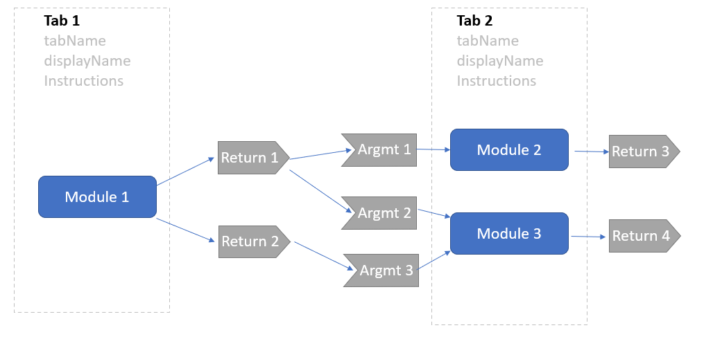
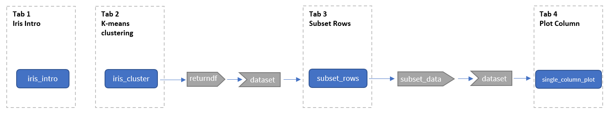
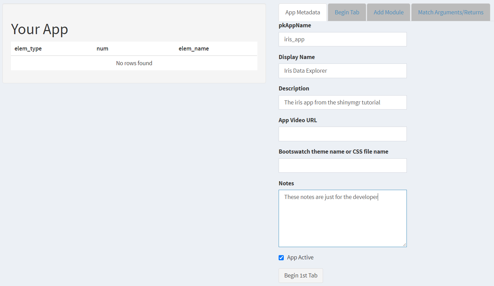
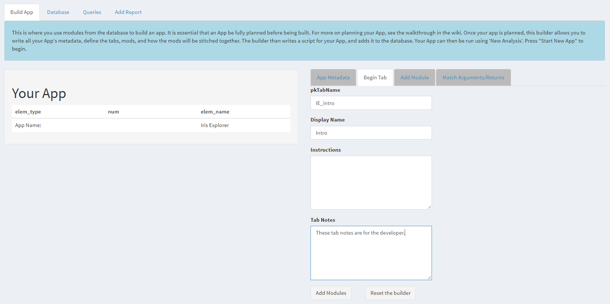
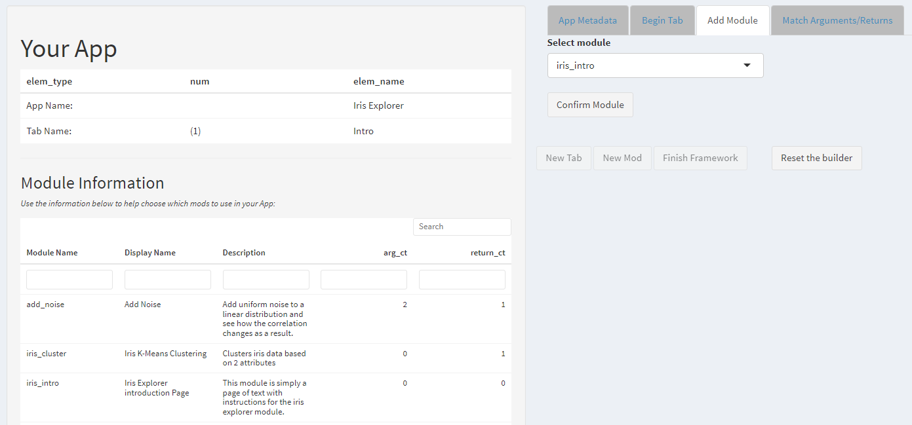
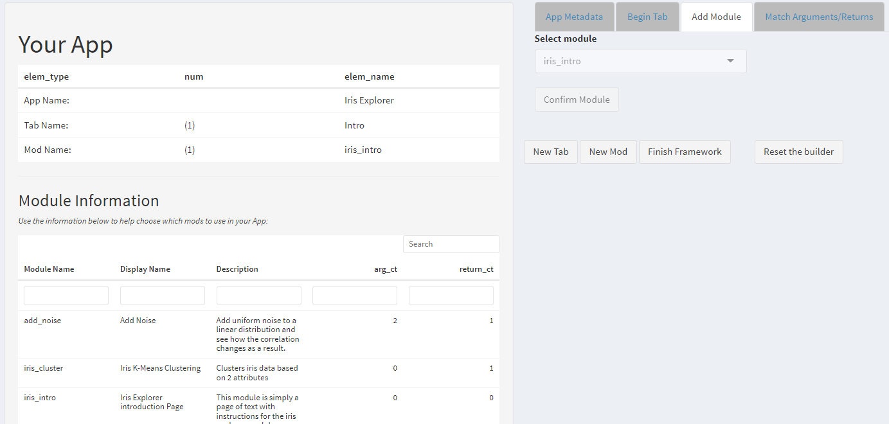
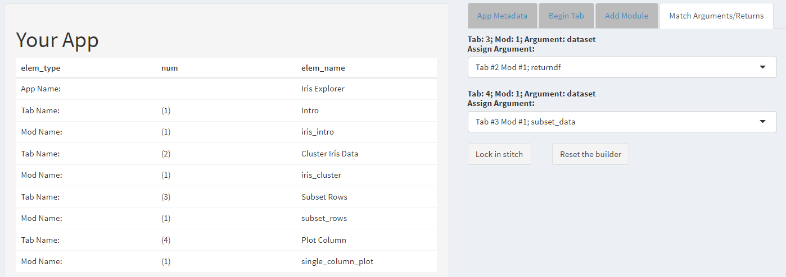
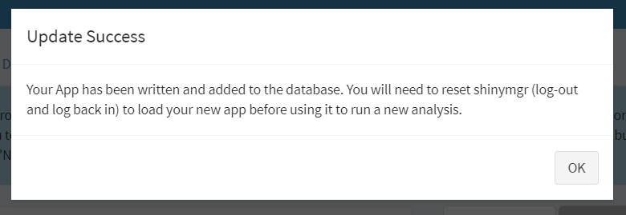
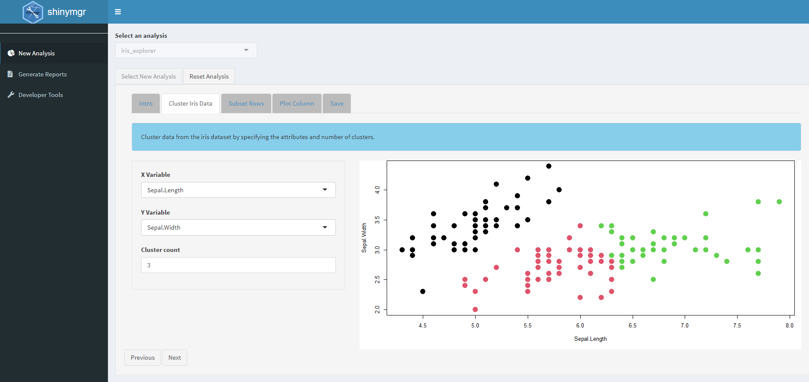

```{r setup, include=FALSE}
source('www/includes.R')
old_knitr.kable.NA <- getOption('knitr.kable.NA')
options(knitr.kable.NA = '')
```

## {width=50px} Introduction

Once stand-alone modules have been registered in the *shinymgr* database, developers can design apps using *shinymgr*'s "App Builder" tool, which populates the *shinymgr* database with instructions on how to build the app and then writes the app's script based on those instructions. Each app, once completed, can be executed in *shinymgr* by the developer or by an end-user as an *analysis* (described in the "analyses" tutorial). Through this structured process, apps produced by the *shinymgr* builder are well-documented and generate highly reproducible analyses. 

In this tutorial, we begin by discussing how to plan your app, then introduce the "App Builder" tool and walk through building the "Iris Explorer" app, resulting in an app module that has a filename of "iris_app.R".  We previously examined elements of this app in other tutorials, and it comes with the *shinymgr* demo as "iris_explorer.R."  However, here we will build the full app under this new name to learn how new apps are made in *shinymgr*.  

The app is shown below (though some functionality is not enabled within the *learnr* tutorial). We conclude by showing the database updates that are performed by the app builder, forming the instructions used by the stitching script to write your app's source code.

<p class=instructions>
Press the Start Analysis button to launch the iris_explorer app.  Start on the Intro tab, then use the *Next* button to advance.  The last tab of each app is the "Save" tab, where you can download the analysis as an RDS file (note that this is not enabled within the tutorial and is included here for illustration only). 
</p>


```{r, echo = FALSE}
fluidPage(
  
  # we keep the header from earlier
  wellPanel(
    h1("Master App"),
    
      # call the iris explorer ui
        iris_explorer_ui("iris"),
    
    tags$br(),
    tags$br()
  )
)

```

```{r, eval = TRUE, echo = FALSE, context = "server"}
  
 # call the server
 iris_explorer_server("iris")

```


>&#128073;&#127998; As you've just seen, all *shinymgr* apps consist of a series of tabs that are worked through in order, creating a structured workflow.  

Typically, an app will begin with a short introduction, and end with the "Save" tab.  Each tab consists of stand-alone modules, where outputs from one module can be used as inputs to another downstream module (either on the same tab or a different one).


## Planning your app


> &#128073;&#127996; Before trying to use the builder to create your app, make a plan!

The first step of building an app is planning it. Just as you wouldn't try to build a house without a blueprint, it is essential to plan your app carefully before you start construction. Some questions to consider:

- What is the sequence of tabs that will be used? 
- What modules are included in each tab?  
- Which module returns will be passed as arguments to other modules later in that sequence? 

### Tabs and modules

In *shinymgr*, tabs are comprised primarily of stand-alone modules, so it is best to begin by defining the modules each tab will require. As you know by now, all modules are stored in the "module" directory of a *shinymgr* project.  A project was created within this tutorial's temporary directory when the tutorial was launched. 

The database table, "modules", will tell you which modules are available to be included in your app.  Let's have a look:


```{r}
# get the database path
db_path <- paste0(tempdir(), "/shinymgr/database/shinymgr.sqlite")

# set a connection to the database
conx <- DBI::dbConnect(
  drv = RSQLite::SQLite(), 
  dbname = db_path
)

# look at the modules table
DBI::dbReadTable(
  conn = conx,
  name = "modules"
)

# disconnect from database
DBI::dbDisconnect(conx)

```

Notice the field "modActive" (a binary field) -- only active modules are available for inclusion in a new app.  Each of these modules has a corresponding R script that contains the actual module code.

Once modules have been defined, they are grouped into tabs. An app written with *shinymgr* follows a strict sequential execution, where users can only  move between tabs using the "previous" and "next" buttons. Importantly, within a tab and between tabs,  any downstream modules that consume arguments returned by other upstream modules should be compatible in their datatypes. For example, a module that returns a matrix cannot be consumed by a downstream module that requires a dataframe input.

The shinymgr function `qry_mod_info()`  returns  information about a module's arguments and returns. For example, the code below queries the arguments and returns for the "subset_rows" module.  

```{r}
# use the qry_mod_info to get names of the args and returns
shinymgr::qry_mod_info(
  modName = "subset_rows",
  shinyMgrPath = paste0(tempdir(), "/shinymgr")
)
```

The results show that the module has one argument named "dataset" that is of class dataframe, and one return named "subset_data" that is also a dataframe.


> &#128073;&#127995; Tabs can contain multiple modules, but as a best practice, consider grouping modules together in a tab only if they do not pass information between them (or you may end up with dependencies that cause unexpected behaviors or just look odd to the end-user when your app is run). 

The last tab of an app will be automatically generated by the builder and will allow the end-user to download an RDS file that contains all  module arguments and returns that were selected during the app's execution. 


### The blueprint

The blueprint for your app can be visualized as a flow diagram defining each component of the app that will be specified in the app builder. 

> &#128073;&#127998;It is strongly recommended that a blueprint following this template be produced for an app before building it. 

```{r fig1,  echo = F, out.width = "100%", fig.cap = ""}

```

Note that the final tab, "Save" is not shown as it is automatically included.  Once a blueprint has been made, building the app is as simple as transposing the flow chart values into the builder. In the next section, we will look at the app builder.

## The iris_app bluepint


In this section, we present a blueprint for "Iris App", which mirrors the now-familiar "Iris Explorer" app illustrated in previous tutorials.  The modules required for this app are already registered in the *shinymgr* database. The app blueprint template has been completed using the defined module names and returns/arguments, which will aid us in populating the "App Builder" with the correct information to build our app.

```{r fig2,  echo = F, out.width = "100%", fig.cap = ""}

```

## shinymgr "App Builder"

The *shinymgr* "App Builder" is the first tab found under the "Developers Tool" menu option and will be visible when that menu option is selected. 

<p class = "instructions">
If you have a second instance of R running, you might like to follow along outside of tutorial-mode. To open a new session, go to Session | New Session.  Then copy the following code into that second instance.
</p>


```{r, warning=FALSE, eval = FALSE}
# set the directory path that will house the shinymgr project
parentPath <- tempdir()

# set up raw directories and fresh database
shinymgr_setup(
  parentPath = parentPath, 
  demo = TRUE
)

# launch shiny mgr in the second instance
launch_shinymgr(
  shinyMgrPath = paste0(tempdir(), "/shinymgr")
)
```

A disclaimer appears at the top of the screen which introduces the builder and encourages users to plan their apps before building (we've already done that). Pressing the "Start New App" button will launch the builder.

This video will briefly introduce the *shinymgr* app builder, followed by a written summary of the key elements.


> &#128073;&#127998; A written summary of the key steps in building an app with *shinymgr* is described below.  

The builder interface shows two main sections, featuring a set of tabs in the right panel that provide guidance to the developer.  In the tab called "App Metadata", the developer is prompted to fill in basic information about the app, beginning with the app name ("iris_app") . 

```{r fig3,  echo = F, out.width = "100%", fig.cap = ""}

```


The **pkAppName** will be how your app is referred to in the database, but users will see the **Display Name** when running the app. 

> &#128073;&#127996; Each **pkAppName** must be unique from any other app in your *shinymgr* project. If you loaded the demo database, and tried to call your app *iris_explorer*, you'll notice that a modal pop-up appears indicating that AppName is already in use. The screenshot above shows that the pkAppName will be "iris_app", which will ultimately result in a script named "iris_app.R".  Two different apps (e.g., "iris_explorer.R" and "iris_app") are allowed to share the same "Display Name", and that is what the end-user will see.


Next, the developer is prompted to provide a short description that explains what the app does. Linking to a video tutorial of your app is possible but not required. If you wish to customize your app's appearance, you can indicate a css file (as *filename.css*) that defines styles for various UI elements (or use one of the Bootswatch themes). Custom css files must be saved to the "www" folder, but Bootswatch themes are loaded from the *shinythemes* package and need only be specified by name (https://rstudio.github.io/shinythemes/). Any app notes entered are strictly for the developer and will not be visible to end-users. 


After you have populated information in the **App Metadata** tab, click the "Begin 1st Tab" button. 

> &#128073;&#127999;The app name you just defined now appears in the left panel under the **Your App** heading, where the components of your app will be updated as you add each element. Note that you do not have the ability to go back and edit previous sections in the "App Builder", and so it is important that you check for correctness before advancing.

Similar to the app metadata, tabs require a **pkTabName** (for the database) and a **Display Name** (visible to the end-user). Multiple apps can share the same tab **Display Name**, but **pkTabName** must be unique between all apps. 

> &#128073;&#127997; Note: Tabs cannot be re-used based on the current implementation of the *shinymgr* "App Builder", but the *shinymgr* database supports this in having a **pkTabName**, and future versions of the "App Builder" may support this.

Tab instructions will be displayed in a `wellPanel()` above any modules that embedded in the tab. Tab notes are for the developer, and not visible to the end-user. Once the tab metadata has been entered, click the "Add Modules" button to continue.

```{r fig4,  echo = F, out.width = "100%", fig.cap = ""}

```

The next step is to add the first module to your first tab. A drop-down menu appears with a list of available modules. Note, since no module returns have been produced yet, only modules that don't require an argument to be passed in are displayed. A rendering of the modules table is displayed in the left panel to assist in selecting a module, but at this stage your app should already be well-planned. After selecting the **iris_intro** module, click the "Confirm Module" button to add it to your app.

```{r fig5,  echo = F, out.width = "100%", fig.cap = ""}

```

Now that your app has a single tab and module, you have the minimum number of components required to build it and will be presented with the option to add a new tab, a new module, or finish the framework. In our case, we'll click the "New Tab" button to add the iris clustering module, as per our blueprint.

```{r fig6,  echo = F, out.width = "100%", fig.cap = ""}

```

From here, we can continue to add any remaining tabs and modules. In the case of our Iris App, we need to add two additional tabs, one with the subsetting module and another with the column plotting module, to complete our blueprint. Click the "Finish Framework" button after all tabs and modules have been added.

> &#128073;&#127995;Each app will automatically receive a "Save Analysis" tab as its last tab, allowing for a standard and consistent way of saving analyses so they can be analyzed or reproduced. 

Note that thus far, we have not specified how information will flow between modules. The final step before your app can be built is to match the module arguments and returns by clicking on the "Match Arguments/Returns" tab.

```{r fig7,  echo = F, out.width = "100%", fig.cap = ""}

```

Matching arguments and returns will instruct *shinymgr* how to "stitch" together all the modules to form your app. To aid this process, the **moduleArguments** and **moduleReturns** tables from the *shinymgr* database are displayed in the left column, but at this stage these should already be well-planned. All module arguments that appear in your app will be listed in the main panel. The numbers used to distinguish each instance of a module (e.g., "Tab: 2; Mod: 1; Argument: dataset") align with the tab and module numbering that appears in the **Your App** summary in the left panel. For each module argument, select the appropriate, matching module return. After you've matched all arguments/returns, click the "Lock in stitch" button to build your app.

> &#128073;&#127996; The app builder will not prevent mismatched arguments and returns between modules. It is the responsibility of you, the developer, to make sure no data type mismatches are introduced at this step.

After clicking `Lock in stitch`, *shinymgr* will write the instructions for building your app to the shinymgr database by adding rows to the apps, tabs, appTabs, tabModules, and appStitching tables. Then, the "App Builder" uses these instructions to write a new file that contains the new *shinymgr* app module.  The script for this module will be written to the "modules_app" folder in the *shinymgr* directory. 

If everything worked as expected, a modal should pop-up indicating that your app was successfully created. 

```{r fig8,  echo = F, out.width = "100%", fig.cap = ""}

```

> &#128073;&#127996; After your app has been built, you will need to close and re-open *shinymgr* to run it. Simply resetting the app will not suffice, since the newly written scripts for your app will need to be sourced in when shiny is initially launched.

After closing and re-opening *shinymgr*, the app you just made will be available to select when running a new analysis.  

```{r fig9,  echo = F, out.width = "100%", fig.cap = ""}

```

## Your app in the database

You have just build your first app using *shinymgr*!  The new app should be called "iris_app.R", but in this section we will look at the "iris_explorer.R" app (which is identical and comes with the demo). The app builder populated the *shinymgr* database with all the pertinent metadata associated with the app. Let's take a look by running some database queries. First, we'll open a connection to the database:

```{r}
# get the database path
db_path <- paste0(
  tempdir(), 
  "/shinymgr/database/shinymgr.sqlite"
)

# set a connection to the database
conx <- DBI::dbConnect(
  drv = RSQLite::SQLite(), 
  dbname = db_path
)
```

Next, we'll see how the tabs contained in our app are stored in the "appTabs" table:

```{r}
# look at the appTabs table in the database
DBI::dbGetQuery(
  conn = conx, 
  statement = "SELECT * FROM appTabs WHERE fkAppName = 'iris_explorer';"
)

```

Here, we see the 4 tabs that were created for the Iris Explorer (note that the "save" module that was added for you automatically is not included in the database). 

Next, let's use the function, `qry_app_flow()` to look at how the modules in each tab are stored in the "tabModules" table. 

```{r}
qry_app_flow(
  appName = "iris_explorer", 
  shinyMgrPath = paste0(tempdir(),"/shinymgr")
)
```

The first column displayed is the *fkAppName*, as defined in the "appTabs" table. The rest of the columns are from the *tabModules* table. The *pkInstanceID* column allows for a tab to contain repeated instances of the same module. In this example, each tab has only a single module, so the *modOrder* column has a value of "1" for all mods. 

Let's conclude our exploration of the database by looking at the stitching instructions for our app stored in the *appStitching* table:

```{r}
# look at the appStitching table in the database
DBI::dbGetQuery(
  conn = conx, 
  statement = "SELECT * FROM appStitching WHERE fkAppName = 'iris_explorer';"
)
```

This table defines how modules are "stitched" together, *i.e.* how returned objects from upstream modules are passed as arguments to downstream modules. It is interpreted easily by the *shinymgr* app builder, but can be challenging for us humans to understand by looking at it. Thankfully, it is not required to understand in order to use *shinymgr*. But, if your curiosity compels you to learn more, then read on.

The *fkInstanceID* refers to an instance of a module in a tab, as defined in the "tabModules" table. The *fkModArgID* refers to a module argument, as defined in the "modFunctionArguments" table. The *fkModReturnID* refers to a module return, as defined in the "modFunctionReturns" table. Finally, the *fkStitchID* refers to an earlier row of the *appStitching* table, and allows an argument defined in the table to reference a previously defined return from a previous row. Each argument and return in the app is referenced by a row in the "appStitching" table. We'll explain the first few rows to give you an idea of what is going on under the hood.

The first row of the "appStitching" table references the module with `fkInstanceID = 2`, namely the **iris_cluster** module in the second tab. We see `fkModReturnID = 2`, and referencing the "modFunctionReturns" table, we see that the return with `pkModReturnID = 2` is named **returndf**.

```{r, echo = FALSE}
DBI::dbGetQuery(
  conn = conx, 
  statement = "SELECT * FROM modFunctionReturns WHERE pkModReturnID = 2;"
)
```

Similarly, the second row of the "appStitching" table references the module with `fkInstanceID = 3`, namely the **subset_rows** module in the third tab. It has `fkModReturnID = 9`, and referencing the "modFunctionReturns" table again, we see that the return with `pkModReturnID = 9` is named **subset_data**.

```{r, echo = FALSE}
DBI::dbGetQuery(
  conn = conx, 
  statement = "SELECT * FROM modFunctionReturns WHERE pkModReturnID = 9;"
)
```

The *fkModArgID* for both of these rows is `NA` since the rows are referring to returned objects and not arguments.

The third row is our first example of an argument being defined in the *appStitching* table, and thus has an `NA` value for the *fkModReturnID*. Like the previous row, the `fkInstanceID = 2` references the **subset_rows** module. We interpret the `fkModArgID = 6` by referencing the "modFunctionArguments" table, where we see the argument with `fkModArgID = 6` is named **dataset**.

```{r, echo = FALSE}
DBI::dbGetQuery(
  conn = conx, 
  statement = "SELECT * FROM modFunctionArguments WHERE pkModArgID = 6;"
)
```

Each argument defined in the "appStitching" table will have a value for the *fkStitchID* that references a returned value from a previous row. In this case, the upstream returned object that will become the defined argument has `fkStitchID = 1`. In other words, the object **returndf** that was returned by the **iris_cluster** module will be passed as the **dataset** argument to the **subset_rows** module. The rest of the "appStitching" table can be interpreted in similar fashion.

What takes multiple paragraphs to explain here is interpreted by the app builder in the blink of an eye. Our advice is to let the builder take care of the stitching and focus your effort on designing your app with a well thought-out blueprint and well-documented modules. Now, before we conclude our discussion of the database updates, let's not forget to disconnect from the database when using the DBI package to query the database:

```{r}
# disconnect from database
DBI::dbDisconnect(conx)
```

## Summary

This tutorial introduced *shinymgr*'s "App Builder", a powerful tool for building a structured workflow based on modules.  

>&#128073;&#127996; If you’d like a pdf of this document, use the browser “print” function (right-click, print) to print to pdf. If you want to include quiz questions and R exercises, make sure to provide answers to them before printing.

## What's next?

In the next tutorial, we'll discuss how to perform an analysis using an app created with *shinymgr.* See you there!

```{r, eval = FALSE}
learnr::run_tutorial(
  name = "analyses", 
  package = "shinymgr"
)
```

```{r cleanup, include=FALSE}
source('www/includes.R')
options(knitr.kable.NA = old_knitr.kable.NA)
```

