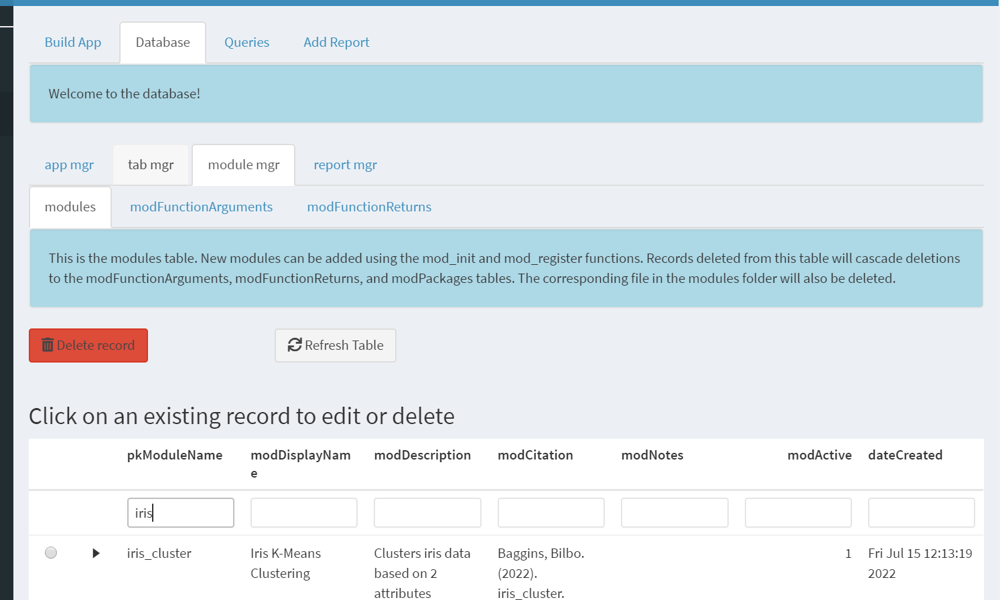

```{r setup, include=FALSE}
source('www/includes.R')
```

## {width=50px} Introduction

By now you are well aware that *shinymgr* relies on a modularized system to guide a user through an analysis. The package itself includes a general framework for managing modules, stitching them together as individual "apps", saving the full analysis as an RDS file, and offering opportunities for rapid reporting. It can be deployed (with minor adjustments) as a stand-alone Shiny application that is housed on a local machine or a server, or can be embedded within R packages for developers who wish to provide Shiny functionality for showcasing their own package. 

During development, the framework is tracked by a SQLite database.  This database allows the *shinymgr* developer to answer these questions: 

1. Which modules have been written?
2. What are the module's inputs and outputs?
3. Are there any package dependencies?
4. For an app such as "iris_explorer", what is the order in which modules are presented in tabs to the Shiny user?
5. Are any reports associated with a particular app?

We'll begin this tutorial by setting up a new *shinymgr* project so that we can explore the database in full.  A new project was created when you launched the tutorial. 

<p class = "instructions">
However, if you have a second instance of R running, you might like to follow along outside of tutorial-mode. To open a new session, go to Session | New Session.  Then copy the following code into that second instance.
</p>

```{r, warning=FALSE, eval = FALSE}
# load shinymgr
library(shinymgr)

# set the directory path that will house the shinymgr project
parentPath <- tempdir()

# set up raw directories and fresh database
shinymgr_setup(
  parentPath = parentPath, 
  demo = TRUE
)
```

As mentioned, the `shinymgr_setup()` function will create a folder called "shinymgr", and will further add 9 subdirectories and three .R files.  

```{r, echo = FALSE, comment = NA}
fs::dir_tree(
  path = paste0(tempdir(), "/shinymgr"),
  recurse = FALSE)
```

The database directory stores the *shinymgr* database for tracking modules, tabs, apps and their associated reports.  Let's peek into the database folder:

```{r, echo = FALSE, comment = NA}
fs::dir_tree(
  path = paste0(tempdir(), "/shinymgr/database"),
  recurse = FALSE)
```

In this tutorial, we introduce the *shinymgr* SQLite database, named "shinymgr.sqlite".  The database tracks all modules, their arguments (inputs), returns (outputs), their package dependencies, how they are combined into an "app", and any reports are associated with apps.  The file "shinymgr.accdb" is an Access database that we use to show how the tables are linked together. 

Notice that a SQLite database is a single file that resides on your machine, much like a single  R script. The package *RSQLite* [@RSQLite] is a dependency of *shinymgr*, so when you installed *shinymgr*, *RSQLite* was also installed. In the process, SQLite was also installed on your machine. So, what is SQLite?  

*"SQLite is an in-process library that implements a self-contained, serverless, zero-configuration, transactional SQL database engine. SQLite is the most used database engine in the world. SQLite is built into all mobile phones and most computers and comes bundled inside countless other applications that people use every day. The code for SQLite is in the public domain and is thus free for use for any purpose, commercial or private. SQLite is the most widely deployed database in the world with more applications than we can count, including several high-profile projects."* -- source:  https://www.sqlite.org/about.html

Because it is free, and thanks to packages such as *RSQLite*, *shinymgr* can use a SQLite database to track all components of a *shinymgr* project.

## Database overview

> &#128073;&#127996; In this section, we will look at the demo database, which was loaded when the tutorial was launched.  The *shinymgr* database is populated entirely via *shinymgr* functions and is administered through the "Database" tab, in the "Developer Tools" section of the *shinymgr* master app.  However, to give you a better understanding of the database design, in this section we will use functions from the *DBI* package [@DBI] to examine the database directly.

The *shinymgr* database is a SQLite database. To work with the database, a connection needs to be made, here using the *DBI* function `dbConnect()`. Once connected, we use the `dbListTables()` functions to list the database tables, and then close the database connection.


```{r}
# get the database path
db_path <- paste0(tempdir(), "/shinymgr/database/shinymgr.sqlite")

# set a connection to the database
conx <- DBI::dbConnect(
  drv = RSQLite::SQLite(), 
  dbname = db_path
)

# look at the tables in the database
DBI::dbListTables(conx)

# disconnect from database
DBI::dbDisconnect(conx)

```

The *shinymgr* database consists of 11 tables in total.  These 11 tables are connected to each other as a typical relational database, with primary keys establishing unique records in each table, and foreign keys that reference primary keys in other tables. Field names that begin with "pk" indicate that the field serves as a primary key and must be unique to each row.  

```{r, echo = FALSE, out.width = "100%", fig.cap = "*Figure 1.  The entity-relationship database model for the shinymgr SQLite datase. The primary key of each table is identified by the key symbol. Lines show how the tables are linked to each each other. *"}

knitr::include_graphics('www/ER2.PNG')
```

The upper 5 tables in Figure 1 are "apps", "appReports", "reports", "tabs", and "appTabs".  These largely store what a user would see when they run an analysis. The table "apps" stores information about apps such as "iris_explorer".  It includes fields such as "pkAppName", "appDescription", "dateCreated", and "appCitation." Apps consist of tabs, which are listed in the "tabs" table. Tabs are linked to apps via the "appTabs" table.  Recall that when a user runs an app, they can save their results as an RDS file.  The table "reports" simply lists any Rmarkdown (.Rmd) or Quarto (.qmd) files that serve as a report template, and the table "appReports" links a specific report with a specific app.  Each Rmd report file allows a user to upload the result of an analysis (the RDS file) and create a canned report as a PDF, HTML, or Word file.  

The lower 6 tables in Figure 1 are "modules", "modFunctionArguments", "modFunctionReturns", "modPackages", "tabModules", and "appStitching".  These largely store information about modules that a developer creates, i.e., what modules have been written, what are the arguments and returns, and what packages they use.  The "tabModules" identify which tabs call which modules, and the "appStitching" table specifies how modules and tabs are "stitched" together to create an app such as "iris_explorer", which sets the analysis workflow.


The *DBI* function `dbListFields()` will show the fields for any specified table.  For example, the code below will list the fields in the "modules" table.

```{r}
# set a connection to the database
conx <- DBI::dbConnect(
  drv = RSQLite::SQLite(), 
  dbname = db_path
)

# look at fields in table modules
DBI::dbListFields(conx, "modules")

# disconnect from database
DBI::dbDisconnect(conx)
```

The *DBI* functions `dbGetQuery()` and  `dbSendQuery()` can be used to send hand-crafted SQL queries to the database, if desired. For example, here we use a PRAGMA call to get more detailed information on the "modules" table, identifying how each column is stored in SQLite, the primary keys, and default values.
```{r}
# set a connection to the database
conx <- DBI::dbConnect(
  drv = RSQLite::SQLite(), 
  dbname = db_path
)

# get more detailed information with a query
DBI::dbGetQuery(
  conn = conx, 
  statement = "PRAGMA table_info('modules');"
)

# disconnect from database
DBI::dbDisconnect(conx)
```

The *DBI* function `dbReadTable()` will allow you to see (or read into R) an entire table. Below we read in the "modules" table and can see the full description of the modules that come with the *shinymgr* demo.  Here, look for the "iris_cluster" and "subset_rows" modules that we introduced in previous tutorials.

```{r}
# set a connection to the database
conx <- DBI::dbConnect(
  drv = RSQLite::SQLite(), 
  dbname = db_path
)

# read the modules table
dbReadTable(
  con = conx,
  name = "modules"
)

# disconnect from database
DBI::dbDisconnect(conx)
```


> &#128073;&#127998;The database does not store the modules themselves. Recall that modules are stored in the "modules" directory with names such as "upload_csv.R", "subset_rows.R", etc., and the field "pkModuleName" is paired with these files. 

> &#128073;&#127995; Similarly, apps are modules, but the code is not stored in the database. Instead, they are stored in the "modules_app" directory with names such as "iris_explorer.R", and the field "pkAppName" in table "apps" is paired with these files.

As we mentioned, the database is accessed via *shinymgr*'s "Developer Tools" section.  We'll look at the database firsthand in the next section.

## Working with the database

<p class = 'instructions'>
If you have a second instance of R running, try entering the following code to launch *shinymgr*.
</p>

```{r, eval = FALSE}
launch_shinymgr(
  shinyMgrPath = paste0(tempdir(), "/shinymgr")
)
```

Click on the "Developer Tools" link in the left menu, and then on the "Database" tab in the main panel.  Here, you should see that the database is organized into 4 main categories, accessible through the tabs "app mgr", "tab mgr", "module mgr", and "report mgr". Each category contains several tables, which are accessed through the tabs that appear under the selected category. For example, the screenshot below shows the "modules" table is accessed under the "module mgr" tab (category).  

```{r, echo = FALSE, out.width = "100%", fig.cap = "*Figure 2.  Screenshot of the database in shinymgr.  The 11 database tables are organized into four major tab groupings. The tables 'modules', 'modFunctionArguments', 'modFunctionReturns' are nested under the 'module mgr' tab.  The 'modules' table is shown, where associated packages can also be seen. A search bar above each column allows for easy filtering; a search for modules with the name 'iris' is shown.*"}


```


Please note the following very important considerations:

1. The database is populated with *shinymgr* functions - records are not inserted manually such as by using `DBI` package directly (see 3 below for an exception to this norm).  We will learn how to use the `mod_init()` and `mod_register()` functions in the next tutorial to populate the "modules", "modFunctionArguments", "modFunctionReturns", and "modPackages" tables.  We will learn how to populate the remaining tables with *shinymgr*'s "App Builder".

2. Records must be deleted by pressing the red delete button.  As modules and apps are tied to linked scripts, deleting a module or an app will delete all downstream entries as well as (optionally) the actual files themselves. For example, if you delete a module, records will be deleted from the "modules" table and will cascade deletions to the "modFunctionArguments", "modFunctionReturns", and "modPackages" tables. The corresponding file in the modules folder will also be deleted, if the "Delete any associated files" checkbox is selected.  If you try to delete a module that is currently used in other apps, the deletion will fail to maintain the integrity of the database and apps.

3. Editing is not permitted in the *shinymgr* database shiny interface. The reason is that the entries in the database are not reflected in the module scripts directly.  For example, a change in the name "iris_cluster" in the database will not change the associated script name, "iris_cluster.R".  However, you may wish to edit descriptions, citations, and other fields. To do so, use the `DBI::dbSendQuery()` function from the *DBI* package to update fields intentionally, taking care not to modify any primary or foreign key references.

## Summary

This tutorial introduced the *shinymgr* SQLite database, which tracks all parts of a *shinymgr* project.  

>&#128073;&#127996; If you’d like a pdf of this document, use the browser “print” function (right-click, print) to print to pdf. If you want to include quiz questions and R exercises, make sure to provide answers to them before printing.

If you wish to go deeper, these links provide information on relational databases and SQL in general: 


- https://www.w3schools.com/sql/
- https://www.sqlitetutorial.net/


## References


<div id="refs"></div>


## What's next?

Now that you understand the need for the *shinymgr* database, our next step is show you how to build a stand-alone module and register it in the database, where it can later be used by a variety of apps. See you there!

```{r, eval = FALSE}
learnr::run_tutorial(
  name = "shinymgr_modules", 
  package = "shinymgr"
)
```

