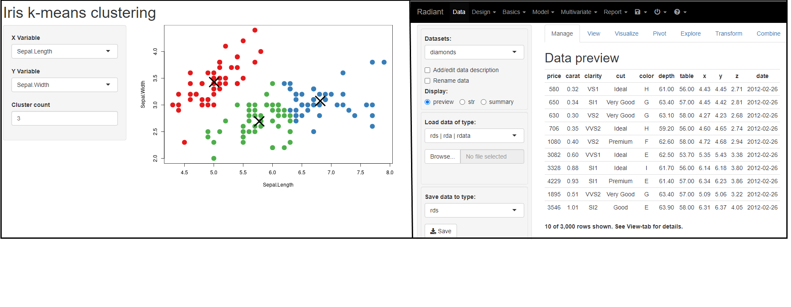
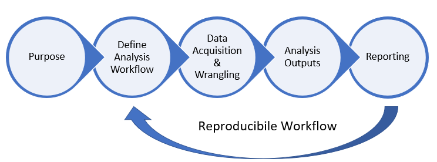
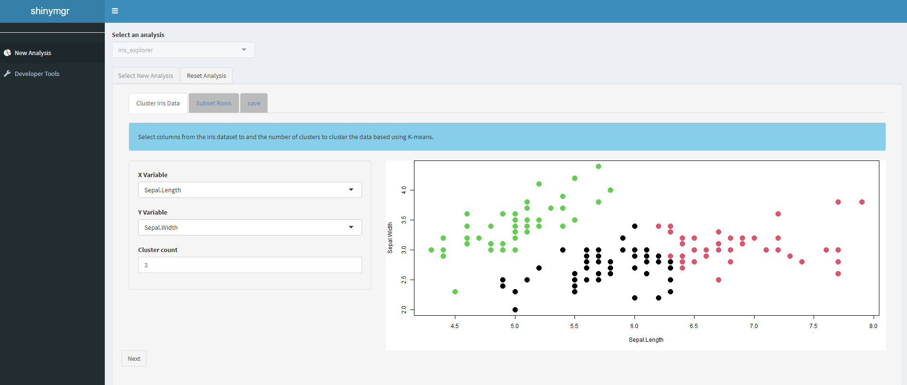

```{r setup, include=FALSE}
source('www/includes.R')
#https://github.com/citation-style-language/styles
```


## {width=50px} Introduction

Shiny is an R package that makes it easy to build interactive web apps straight from R [@shiny].  As Hadley Wickham, author of Mastering Shiny @mastering, writes, "*Today, Shiny is used in almost as many niches and industries as R itself is. It’s used in academia as a teaching tool for statistical concepts, a way to get undergrads excited about learning to write code, a splashy medium for showing off novel statistical methods or models. It’s used by big pharma companies to speed collaboration between scientists and analysts during drug development. It’s used by Silicon Valley tech companies to set up realtime metrics dashboards that incorporate advanced analytics.*" 

Shiny applications can range from simple to complex, each with an intended purpose developed for an intended user audience (Figure 1).


```{r fig1,  echo = F, out.width = "100%", fig.cap = "*Figure 1.  Left: A simple Shiny application that allows users to select two columns from the iris dataset (X Variable and Y Variable), along with the number of desired clusters (Cluster count); the app returns a scatterplot that identifies points by cluster. Source: https://shiny.posit.co/r/gallery/start-simple/kmeans-example/.   Right: A complex Shiny application for statistics and machine learning called Radiant. Source:  https://shiny.posit.co/r/gallery/education/radiant/*"}

```


Shiny apps can be deployed on a server (such as https://www.shinyapps.io/), or they can be deployed in R directly, where a desktop machine serves as the local host.  Many R packages today include a Shiny application that can be used to streamline analyses or illustrate a workflow.

Complex applications, such as the Radiant Shiny app shown in Figure 1, may have multiple tabs, inputs, and functionalities. Radiant allows users to work with datasets, design experiments, run many kinds of analyses, and produce reports in a variety of formats. However, from the developer perspective, complex applications can result in many lines of code, creating challenges for collaborating, debugging, streamlining, and maintaining the overall product.  

Shiny modules are a solution to this problem. As stated by Winston Chang, "*A Shiny module is a piece of a Shiny app. It can’t be directly run, as a Shiny app can. Instead, it is included as part of a larger app (or as part of a larger Shiny module – they are composable).  Modules can represent input, output, or both. They can be as simple as a single output, or as complicated as a multi-tabbed interface festooned with controls/outputs driven by multiple reactive expressions and observers. Once created, a Shiny module can be easily reused – whether across different apps, or multiple times in a single app.*" -- source: https://shiny.posit.co/r/articles/improve/modules/.  

Several authors have contributed R packages for distributing pre-written modules for general use, including the *datamods* [@datamods], *shiny.reglog* [@reglog], periscope [@periscope], *shinyauthr* [@shinyauthr], *modchart* [@modchart], and *jsmodule* [@jsmodule] packages.

```{r, eval = FALSE, echo = FALSE}
# see golem as a major competitor
https://engineering-shiny.org/
```

While shiny modules offer several benefits, challenges can arise in the development of apps that use modules, such as tracking available modules, testing them, storing them, and stitching them together into an app where outputs from one module can serve as inputs to the next.  Taken together, these elements permit an expedient analysis pipeline or workflow that is fully reproducible [@Peng; @Gentleman; @Alston]. Moreover, the pipeline should permit rapid reporting to convey the results of an analysis workflow to a target audience (Figure 2).  

```{r, eval = FALSE, echo = FALSE}
https://www.datascience-pm.com/data-science-methodologies/
https://en.wikipedia.org/wiki/Scientific_workflow_system
https://hevodata.com/learn/data-science-workflows/
```

```{r, echo=FALSE, out.width="100%", fig.cap="*Figure 2. Idealized data science analysis pipeline identifies the purpose of a given analysis, the analytical steps, and the ability to produce outputs that can be rapidly disseminated in a reproducible framework.*"}
#knitr::include_graphics('www/Data+Science+Workflow+Image.jpg')



```


## Introducing shinymgr

Here, we introduce *shinymgr*, an R package that provides a unifying framework for managing and deploying Shiny applications that consist of modules.  From the user's perspective, an “app” consists of a series of RShiny tabs that are presented in order, establishing an analysis workflow (Figure 3). The inputs and outputs of a given app can be saved as an .RDS file to ensure reproducibility. Further, the .RDS file may be loaded into an R Markdown (.Rmd) or Quarto (.qmd) template for rapid reporting.  

<hr>

```{r fig2,  echo = F, out.width = "100%", fig.cap = "*Figure 3. The main panel shows the 'iris_explorer' app, which consists of three tabs that guide a user through a workflow. Tab 1 is displayed.*"}

```


From the developer's perspective, each tab in an "app" consists of one or more Shiny modules. Each tab is defined as focused, compartmentalized code that typically has a singular objective.  Modules are the basic element in the *shinymgr* framework; they can be used and re-used across different tabs and different apps.  The *shinymgr* app builder "stitches" shiny modules together so that outputs from one module serve as inputs to the next, creating an analysis pipeline that is easy to implement and maintain.

In short, developers use the *shinymgr* framework to write modules and seamlessly combine them into shiny apps, and users of these apps can execute reproducible analyses that can be incorporated into reports for rapid dissemination.

## shinymgr tutorials

We introduce *shinymgr* through a series of tutorials that come with the package.  Below is a list of current tutorials, intended to be worked through in order:

```{r, warning = FALSE, results ='asis'}
learnr::available_tutorials(
  package = "shinymgr") %>% 
  dplyr::arrange(title) %>%
  dplyr::select(c('name', 'title'))

```

The *name* column provides the tutorial identifier (e.g, name = "modules" is tutorial #3). You are currently reading the "intro" tutorial.   See below for each tutorial's description! 

```{r, warning = FALSE, echo = FALSE}
tuts <- learnr::available_tutorials(
  package = "shinymgr") %>% 
  dplyr::arrange(title)

# show just the name and description
tuts$summary <- paste0(tuts$name, ": ", tuts$description)
tuts$summary
```

>  &#128073;&#127998; We highly recommend that you create a new RStudio project (folder) that is your home base for working through tutorials.  Once there, open R and ensure this folder is your working directory.  Our tutorial examples will use `tempdir()` to reference your home base in many tutorials.

Launch a tutorial with the *learnr* `run_tutorial()` function, providing the name of the module to launch like this:  

```{r, eval = FALSE}
learnr::run_tutorial(
  name = "modules", 
  package = "shinymgr"
)
```

The tutorial should launch in a browser, which has the benefit of being able to print the tutorial to PDF upon completion.

> &#128073;&#127996; If you have a large monitor, or even 2 monitors, you may find it very useful to run the tutorials as described, but to also launch a second instance of R that is not running a tutorial. This will allow you to try out some code outside the tutorial environment.  To do so, select Session | New Session from the main toolbar in RStudio. 

## How to use *learnr* tutorials

All tutorials were written with the R package, *learnr*. You're looking at the introductory tutorial. Each tutorial is divided into topics, which can be seen in the left menu.  As you work though the topics, your progression is saved.  This means you can close out when needed and pick up where you left off at a later time.  The _very small_ "Start Over" button at the bottom of the left menu will sweep clean any progress so you can start afresh if needed.

Tutorials consist of  written content (like you're reading now) and R examples, but may also include short videos, interactive R coding and demos, and quizzes.

```{r intro, echo = FALSE}
question_text(
  " We're glad you're here!  Tell us about yourself in a sentence or two:",
  answer("", correct = TRUE),
  incorrect = "<p>&#128526;</p>",
  #allow_retry = TRUE,
  trim = TRUE
)
```


## Tutorial formatting

Tutorials are designed to be informative and engaging.  If we want to highlight a key concept, we will place in a large yellow box, like this: 

> &#128073;&#127997;  Hey! This is important!


If we want to show you how to do something in R, you should see a green colored "code chunk" that illustrates something, like this:

```{r}
# add 1 + 1
1 + 1
```

The inputs into R are shaded green, and typically include a short comment that starts with a hashtag (e.g., # add 1 + 1).  Comments are not executed by R; they are notes to the programmer (you!).  The outputs are identified by the double hashtag symbol enclosed in a gray or white box as shown above.  

If you have a second instance of RStudio open and would like to  follow along, you could copy this code and paste it into your R console and execute it in that second instance.  

> &#128073;&#127999; When a *learnr* tutorial is active, your R console cannot be accessed because it is "busy" with the tutorial.  Instead of coding in the R console, coding is done directly in the tutorial, as you'll see in  a few seconds. This is why running a second instance of R may be useful -- it will not be locked into the tutorial.

Tutorials are designed to give you hands-on practice. Exercises are identified with instructions provided in a steel blue box, like this:

<p class=instructions>
Enter the equation 1 + 1 in the box below, and execute it by pressing the "Run Code" button.
</p>


```{r pr1, exercise = TRUE}

```

```{r pr1-hint}
1 + 1
```

Hints may or may not be included, so make sure to look for them!  Press the "Hint" button to see the hint.

Quizzes may include short answers or multiple choice questions, like this one provided by the authors of the *learnr* package:

```{r letter-a, echo=FALSE}
quiz(
  question("What number is the letter A in the English alphabet?",
    answer("8"),
    answer("14"),
    answer("1", correct = TRUE),
    answer("23")
  ),
  question("Where are you right now? (select ALL that apply)",
    answer("Planet Earth", correct = TRUE),
    answer("Pluto"),
    answer("At a computing device", correct = TRUE),
    answer("In the Milky Way", correct = TRUE),
    incorrect = "Incorrect. You're on Earth, in the Milky Way, at a computer."
  )
)
```

Your answers are saved in the tutorial itself (unless you press Start Over button in the left menu, which will erase any previous work).  

Tutorials may include Shiny elements, like the one below showing the waiting time between eruptions for the Old Faithful geyser in Yellowstone National Park, Wyoming, USA.  In this case, R receives "user-inputs" from a slider and produces a histogram output of waiting times.  Because *shinymgr* is an R package that helps organize, test, and combine Shiny modules into a larger application, many of the tutorials will include R Shiny.

<p class=instructions>
Use the slider to change the number of grouping "bins" in the histogram below:
</p>


```{r, echo = FALSE}
# set the user slider input
sliderInput(
  inputId = "bins",
  label = "Number of bins:",
  min = 1,
  max = 50,
  value = 30
)

# establish a plce for the plot output
plotOutput(outputId = "distPlot")
```

```{r, context = "server"}
output$distPlot <- renderPlot({
    x    <- faithful$waiting
    bins <- seq(min(x), max(x), length.out = input$bins + 1)

    hist(x, breaks = bins, col = "#75AADB", border = "white",
         xlab = "Waiting time to next eruption (in mins)",
         main = "Histogram of waiting times")
    })
```


## Tutorial summary 

We've briefly introduced the package, *shinymgr*, and provided an overview of how *learnr* tutorials work.  

>&#128073;&#127996; If you’d like a pdf of this document, use the browser “print” function (right-click, print) to print to pdf. If you want to include quiz questions and R exercises, make sure to provide answers to them before printing.

## References


<div id="refs"></div>


## What's next

You're finished!  If you are new to shiny, the next tutorial provides an overview of Shiny, where you will build a simple shiny app featuring the iris dataset.   

```{r, eval = FALSE}
learnr::run_tutorial(
  name = "shiny", 
  package = "shinymgr"
)
```

If you are experienced with shiny, modules, and testing, you can safely jump to the "shinymgr" tutorial (tutorial #6).  See you there!

```{r}
learnr::available_tutorials(package = "shinymgr")
```


