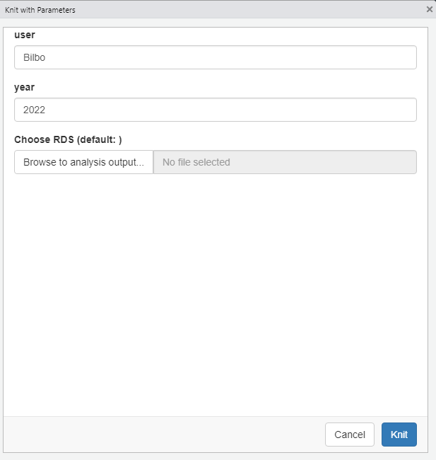
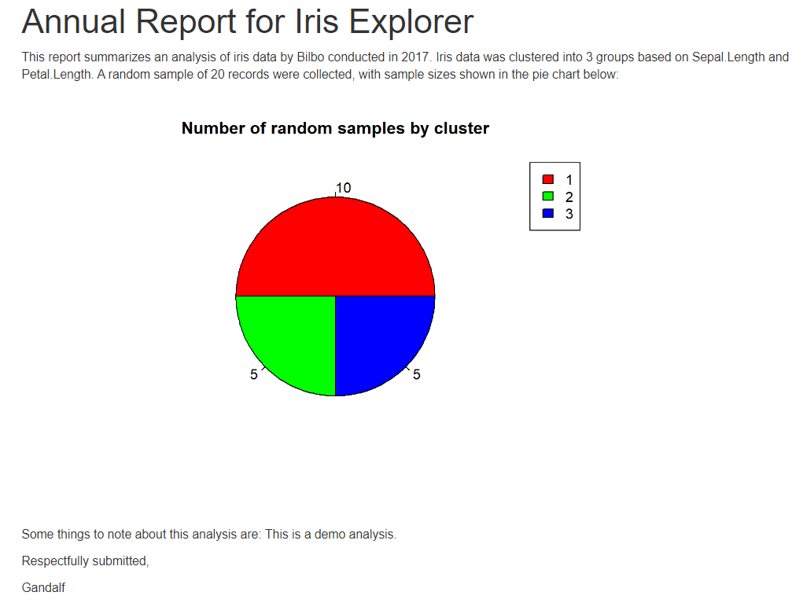
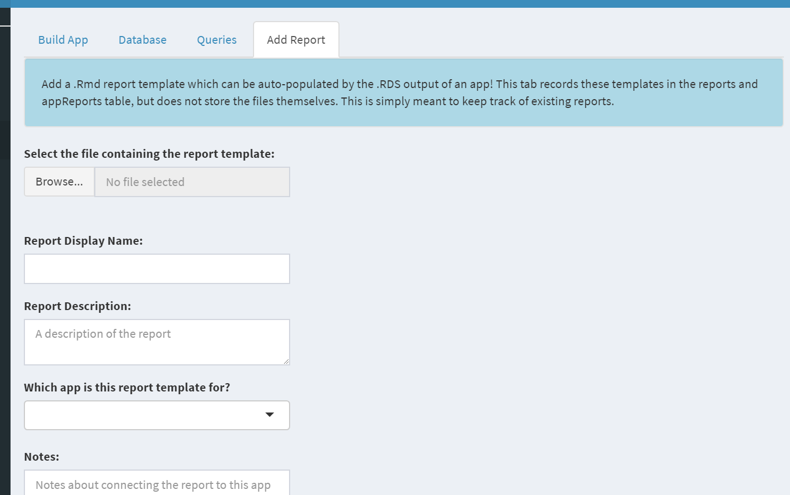
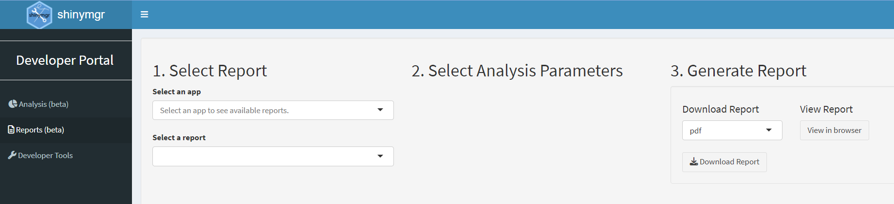

```{r setup, include=FALSE}
source('www/includes.R')
```

## {width=50px} Introduction

In the "analyses" tutorial, you learned how *shinymgr* saves each step of an analysis as an RDS file.  This critical feature allows reproducibility: Making data and code available in such a way that the computations can be executed again with identical results.  

But raw results in and of themselves do not communicate a story to audiences in an accessible, understandable or useful way. 

Another important feature of *shinymgr* is the ability to the share results of an analysis with others in a friendly, readable format. In this tutorial, we'll introduce you to R Markdown, an easy-to-write plain text formatter designed to make web content and reports easy to create. We'll also describe Quarto, an open-source scientific and technical publishing system that extends Rmarkdown considerably. 


## R Markdown

If you are new to RMarkdown, please watch this short introductory video  by Roger Peng, Professor of Biostatistics at the Johns Hopkins Bloomberg School of Public Health (posted at  https://www.youtube.com/watch?v=DNS7i2m4sB0&t=63s): 


{width="90%"}

If you plan on including a lot of reporting options in your own *shinymgr* project, we highly recommend you read the on-line book posted at https://rmarkdown.rstudio.com/lesson-1.html

> &#128073;&#127996; *shinymgr* developers will create customized R Markdown files that load the RDS from a given *shinymgr* analysis, incorporating those results with "canned" text to provide a means of rapid reporting.  Users who run a report can download it to their local machine as a HTML, PDF, or Word file, where they can further customize the output. 

> &#128073;&#127998; *shinymgr* users who are savvy with R can also create customized R Markdown files that load the same RDS from a given *shinymgr* analysis and incorporate those results into their custom  report. 

We will illustrate the process in the next sections.

## Parameterized reports

In order to ingest an RDS file into an R Markdown report, the R Markdown file must include *parameters*.  


*"One of the many benefits of working with R Markdown is that you can reproduce analysis at the click of a button. This makes it very easy to update any work and alter any input parameters within the report. Parameterized reports extend this one step further, and allow users to specify one or more parameters to customize the analysis. This is useful if you want to create a report template that can be reused across multiple similar scenarios. Examples may include showing results for a specific geographic location, running a report that covers a specific time period, and running a single analysis multiple times for different assumptions"*  --  Source: https://bookdown.org/yihui/rmarkdown/parameterized-reports.html


This is exactly the intention of *shinymgr* reports: each analysis produces an RDS file that stores the results of the analysis and accompanying metadata.  The results can be soaked into a "canned" R Markdown report and used in the report by declaring parameters.  

The parameters of a R Markdown report are identified in the file's YAML header, like shown below: 

````{verbatim}
----
title: 'Annual Report for Iris Explorer'
output: html_document
params:
  user: Bilbo
  year: 2022
  file: 
   input: file
   label: "Choose RDS"
   value: ""
   multiple: FALSE
   buttonLabel: "Browse to analysis output..."
---
````

Notice there are three parameters listed:  "user", "year", and "file". When this document is "knit with parameters", the user will be greeted with a dialogue box, where they can enter their own user name, year, and browse to the RDS file that stores the results of a *shinymgr* analysis. These inputs default to a textbox input, but can be changed using the *input* argument (e.g. "input: file").


```{r, echo = FALSE, out.width = "90%", fig.align = "left", fig.cap = "*Figure 1. When a parameterized report is knit, the user will be shown a dialogue box for entering parameter values.*"}


```


More information about parameterized reports can be found at [https://bookdown.org/yihui/rmarkdown/parameterized-reports.html](https://bookdown.org/yihui/rmarkdown/parameterized-reports.html)

> &#128073;&#127997; All *shinymgr* reports should include a "file" parameter that allows a user to browse to a *shinymgr* analysis RDS file of interest.   This emphasizes that report is paired with a specific *shinymgr* app.

> &#128073;&#127996; If a saved analysis (RDS) file is bigger than 5MB, you can adjust the maximum size allowed for file inputs using the shiny.maxRequestSize option. For example, running `options(shiny.maxRequestSize = 50*1024^2)` increases the limit to 50MB.

## Reports in shinymgr

A *shinymgr* project was loaded when you launched this tutorial so that you can see how report management is handled.   

<p class = "instructions">
If you would like to follow along in a separate instance of R, go to Session | New Session.  Then paste in the following code.
</p>

```{r, eval = FALSE}
library(shinymgr)

# set up raw directories and fresh database
shinymgr_setup(
  parentPath = tempdir(), 
  demo = TRUE
)

```

Several R Markdown files are include with the demo *shinymgr* framework. Let's have a look:

```{r}
data.frame(
  reports = list.files(
   path = paste0(tempdir(), "/shinymgr/reports"),
   full.names = FALSE,
   recursive = TRUE
  )
)
```


Each report is a R Markdown file tied to a specific app, and is located in a sub-folder with the app's name.  For example, "iris_explorer_report.Rmd" is linked to the app "iris_explorer" and "linear_eq_explorer_independent.Rmd" is linked to the app "linear_eq_explorer".  An app can have multiple reports that are tracked in the *shinymgr* database.

>  &#128073;&#127999; The code below shows  the "iris_explorer_report.Rmd" script.  Notice the following: (1) The YAML header includes parameters as described above, except that the parameter **year** has been converted to a slider input; (2) In the setup code chunk, the saved **shinymgr** analysis RDS file is read in and stored as the object **ps** (which is short for parameters). As discussed in the previous tutorial (Analyses), the data type of **ps** is a list. Any of the R objects within this list are available to be included in the report; (3) The narration paragraph "This report . . ." includes in-line calls to *r* such as *r param\$user*, which will render the value entered for the "user" at start-up; (4) The narration also includes outputs generated from the **ps** list (*e.g.*, *ps\$returns\$data2\$subset_data$cluster* is used to create a pie chart). 

```{r, comment = '', echo=FALSE, class.output='r'}

cat(paste(readLines(rmd_fp), collapse = '\n'))
```


The rendered report, when knit with parameters, looks like this:

```{r, echo = FALSE, out.width = "100%", fig.align = "left", fig.cap = "*Figure 2. After the user provides inputs to the report, the rendered Rmarkdown report is displayed, and may be saved in a variety of formats.*", out.extra='style="background-color: #999999; padding:5px; display: inline-block;"'}


```


R Markdown reports are incredibly flexible, allowing the creator to include whatever elements from the analysis RDS are desired. The *shinymgr* developer can create new reports as needed.

## Quarto

Reports can also be written with Quarto, which extends RMarkdown in several ways and is multi-platform.  The Quarto welcome page at https://quarto.org/  states: "Quarto is a multi-language, next generation version of R Markdown from Posit, with many new new features and capabilities. Like R Markdown, Quarto uses Knitr to execute R code, and is therefore able to render most existing Rmd files without modification."

The example Quarto code from https://quarto.org/ is pasted below:

````{verbatim}
---
title: "ggplot2 demo"
author: "Norah Jones"
date: "5/22/2021"
format: 
  html:
    fig-width: 8
    fig-height: 4
    code-fold: true
---

## Air Quality

@fig-airquality further explores the impact of temperature on ozone level.

```{r}
#| label: fig-airquality
#| fig-cap: "Temperature and ozone level."
#| warning: false

library(ggplot2)

ggplot(airquality, aes(Temp, Ozone)) + 
  geom_point() + 
  geom_smooth(method = "loess"
)
 ```
````

The YAML header is similar to Rmd, but the code chunk options are specified differently.  The Quarto user's guide is found at https://quarto.org/docs/guide/. 

## Registering a report

Once an Rmd or Quarto report file has been created by developers, it must be registered in the database, where it can be associated with a given app. This is done through *shinymgr*'s Developer Tools.

<p class = "instructions">
If you have a second instance of R running, try entering the following code to launch *shinymgr*.  Then click on the "Developer Tools" tab in the left menu, and look for the "Add Report" tab. There, you will browse to the Rmd file of the report to be registered and provide report details.  A record will be logged in the "reports" table of the database, and further will be associated with an app in the "appReports" table. The Rmd file will be copied to the "reports" directory of the *shinymgr* project, into a folder with the app's name.
</p>


```{r, eval = FALSE}
launch_shinymgr(
  shinyMgrPath = paste0(tempdir(), "/shinymgr")
)
```


```{r, echo = FALSE, out.width = "100%", fig.align = "left", fig.cap = "*Figure 3. Reports are registered in the database and linked to a specific shinymgr application.*"}


```

```{r howmany, echo = FALSE}
quiz(
  question("How many reports can be associated with a single app?",
    answer("1"),
    answer("5"),
    answer("10"),
    answer("As many as needed", correct = TRUE),
    message = "Reports associated with an app are stored in a subdirectory of the reports folder with the app's name. A single app can have as many reports as desired.",
    allow_retry = TRUE
  )
)

```

> &#128073;&#127995; Reports are deleted in the database tab under "Developer Tools".  If a report is deleted from the database, the record will be removed from both the "reports" table and "appReports" table, and the Rmd file can optionally be removed from the "reports" *shinymgr* directory.


## Running a report through shinymgr

Reports can be run in two ways.  

1.  They can be run through the *shinymgr* framework app by clicking the "Reports (beta)" tab in the left menu of the Developer's Portal. 
2. As previously hinted, reports can run directly by opening the Rmd file, and navigating to the corresponding RDS file that holds the results of a *shinymgr* app.

Here's what the first option looks like from the Developer's Portal, where the developer can beta test the rendered report:

```{r, echo = FALSE, out.width = "100%", fig.align = "left", fig.cap = "*Figure 4. A report can be run through the 'Reports (beta)' button, allowing developers to select a report, enter parameter values, and generate the output.  The RDS file input parameter is required for all shinymgr reports.*"}


```


> &#128073;&#127999; When a developer deploys a *shinymgr* project for external users, the Analysis and Reports tabs can be retained and modified so that *their* users can similarly run reports and analyses, as described in the "deployment" tutorial.

You can try the second option on your own by running the iris_explorer report:

```{r, eval = FALSE}
report_fp <- paste0(
  find.package("shinymgr"),
  "/shinymgr/reports/iris_explorer/iris_explorer_report.Rmd"
)

rds_fp <- paste0(
  find.package("shinymgr"),
  "/shinymgr/analyses/iris_explorer_Gandalf_2023_06_05_16_30.RDS"
)

rmarkdown::render(
  input  = report_fp,
  output_format = "html_document",
  output_file = "report_test.html",
  output_dir = tempdir(),
  params = list(
    user = "Gandalf",
    year = 2022,
    file = rds_fp
  )
)
  
```


## Tutorial summary 

We've briefly introduced the *shinymgr* reporting system in this tutorial.  Reports are R Markdown files that can ingest the outputs from a given *shinymgr* analysis, stored in an RDS file.  R Markdown reports offer an expedient way of sharing key results with stakeholders.

>&#128073;&#127996; If you’d like a pdf of this document, use the browser “print” function (right-click, print) to print to pdf. If you want to include quiz questions and R exercises, make sure to provide answers to them before printing.

There is no shortage of instructional content for writing reports with RMarkdown or Quarto. Here are a few options to explore.


- Introduction to Rmarkdown - https://rmarkdown.rstudio.com/articles_intro.html.
- Beyond Static Reports With R Markdown | RStudio Webinar - 2017 - https://www.youtube.com/watch?v=sQjnvaf072M)
- R Markdown Advanced Tips to Become a Better Data Scientist & RStudio Connect - https://www.youtube.com/watch?v=WkF7nqEYF1E&t=3s
- Rob Hyndman | How Rmarkdown changed my life - https://www.youtube.com/watch?v=_D-ux3MqGug&t=4s
- Yihui Xie | One R Markdown Document, Fourteen Demos - https://www.youtube.com/watch?v=qLEkUjxk7e8
- R Markdown Gallery - https://rmarkdown.rstudio.com/articles.html
- Quarto FAQ for R Markdown users:  https://quarto.org/docs/faq/rmarkdown.html
- Quarto user guide:  https://quarto.org/docs/guide/


## What's next

You're finished!   Assuming you developed all of the modules, apps, and reports that you need, you may be ready to amicably divorce from *shinymgr* and move the entire framework to your own package or server, where you can deliver a streamlined analysis workflow for your own users.  See you there!

```{r, eval = FALSE}
learnr::run_tutorial(
  name = "deployment", 
  package = "shinymgr"
)
```


