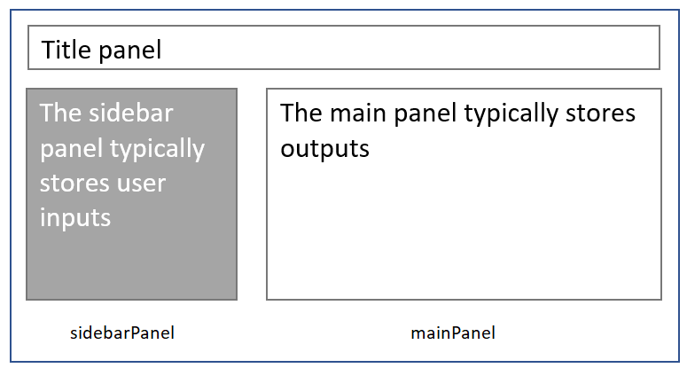

```{r setup, include=FALSE}
source('www/includes.R')
```

## {width=50px} Introduction

Shiny is an R package that makes it easy to build interactive web apps using R. If you are already familiar with shiny, you can skim this tutorial.  For the rest of you, we're going to build a simple stand-alone Shiny app in this tutorial.  This app is the k-means cluster example provided at https://shiny.posit.co/r/gallery/start-simple/kmeans-example/, and is a quintessential starter app for Shiny developers.  After we've built this app, we will turn it into a **module** in the next tutorial.

The app loads the built-in iris dataset.  If you're not familiar with the iris dataset, let's have a quick look.  This dataframe stores floral characteristics of three *Iris* species (*setosa*, *versicolor*, and *virginica*), including the length and width of the flowers' sepals and petals. These metrics are stored as numbers. 

```{r, echo = TRUE}
# load the built-in dataset
data(iris)

# look at the first 5 records
head(iris, n = 5)
```

The app will allow user to select two columns (X Variable and Y Variable) from the iris dataset, and indicate how many clusters are desired.  Behind the scenes, R will run a k-means clustering algorithm on the selected columns.  The output is a scatterplot that shows the two variables by cluster.

Here is the app in action (see also https://shiny.posit.co/r/gallery/start-simple/kmeans-example/).

<p class=instructions>
Choose an X and Y variable from the iris dataframe, and select the number of clusters for grouping:
</p>

```{r, irisApp1}
 fluidPage( 
  
  # add a title with the titlePanel function
  titlePanel("Iris k-means clustering"),
  
  # set up the page with a sidebar layout
  sidebarLayout(
    
    # add a sidebar panel to store user inputs
    sidebarPanel(
      
      # add the dropdown for the X variable
      selectInput(
        inputId = "xcol", 
        label = "X Variable", 
        choices = c(
          "Sepal.Length", 
          "Sepal.Width", 
          "Petal.Length", 
          "Petal.Width"),
        selected = "Sepal.Length"
      ),
      
      # add the dropdown for the Y variable
      selectInput(
        inputId = "ycol", 
        label = "Y Variable", 
        choices = c(
          "Sepal.Length", 
          "Sepal.Width", 
          "Petal.Length", 
          "Petal.Width"),
        selected = "Sepal.Width"
      ),
      
      # add input to store cluster number
      numericInput(
        inputId = "clusters", 
        label = "Cluster count", 
        value = 3, 
        min = 1, 
        max = 9
      )
      
    ), # end of sidebarPanel function
    
    # add a main panel & scatterplot placeholder
    mainPanel(
      plotOutput(
        outputId = "plot1"
      )
      
    ) # end of mainPanel function
    
  ) # end of sidebarLayout function
  
) # end of fluidPage function
      
```

```{r, context = "server"}
 # subset the iris data
  selectedData <- reactive({
    iris[, c(input$xcol, input$ycol)]
  })
  
  # run the kmeans clustering 
  clusters <- reactive({
    kmeans(
      x = selectedData(), 
      centers = input$clusters
    )
  })
  
  # produce the scatterplot
  output$plot1 <- renderPlot({
    oldpar <- par('mar')
    par(mar = c(5.1, 4.1, 0, 1))
    p <- plot(
      selectedData(),
      col = clusters()$cluster,
      pch = 20, 
      cex = 3
    )
    par(mar=oldpar)
    p
  })
```

Notice that the user inputs are entered in the left panel (gray), and app outputs are displayed in the right panel, a layout known as a "sidebar layout".

```{r fig1,  echo = F, out.width = "80%", fig.align = "center", fig.cap = "*Figure 1. The 'iris_explorer' shiny app utilizes a 'sidebar layout', where user inputs are entered in the sidebarPanel and primary outputs are displayed in the mainPanel.*"}

```


## Elements of an app

To create the iris k-means cluster app, we begin by loading the shiny package.

```{r, echo = TRUE, eval = FALSE}
library(shiny)
```

Next, we need two things:

1. The HTML code that will create the overall webpage, including the user inputs and a placeholder that will display outputs.  This will be called the UI, or user interface. 

2. The R code that takes inputs and generates HTML outputs.  

> &#128073;&#127996;You won't write HTML by hand.  Instead, you will create the UI with a "ui" generating function in Shiny that will generate the user interface HTML code.  Then, you will create a paired "server" function in R that will take in the user's inputs, generate the output HTML code, and send this back to the UI for display. 

The name of the server function will be "iris_cluster_server", and the name of the UI object is "iris_cluster_ui".  In short, the UI object should have the same root name as the server function (iris_cluster) with "UI" appended to the end (iris_cluster_ui).  As we'll see, the shiny package comes with many UI generating functions, while the server function is hand-crafted.

Here is an outline to begin (this is a single code block but we have highlighted different sections for clarity):

```{r, eval = F, echo = TRUE}
# general outline of the iris cluster app

#  the UI function
iris_cluster_ui <- a_UI_generating_function(
```
```{r, eval = F, echo = TRUE, class.source="bg-danger"}  
  
  # code that creates the user interface goes here 
```

```{r, eval = F, echo = TRUE}
)

# the server function 
iris_cluster_server <- function(input, output){ 
```

```{r, eval = F, echo = TRUE, class.source="bg-danger"}  
  
  # code that takes inputs from the UI 
  # and generates outputs goes here
```
```{r, eval = F, echo = TRUE}
}
```

Once filled in, we will save the file with the name "app.R", which indicates that it is a Shiny app.  Now, let's work on the two required components.  

## The UI function

Commonly, we start by generating the user interface. To create the UI object **iris_cluster_ui**, we will use one of RShiny's functions.  There are several shiny functions that provide layouts for shiny apps. In the example below, we will use the `fluidPage()` function to create the HTML user interface.   The user interface consists of the three user inputs (the two dropdowns that allow a user to select two iris metrics, and an input box where the user can specify the number of clusters desired) as well as the main output.

The `fluidPage()` function will create the HTML code for the outermost container that will hold the app's contents, and store it as an R object called **iris_cluster_ui**.  Inside this function, you can use the `titlePanel()` function to set the title, and the `sidebarLayout()` function to specify the interface layout. This layout includes a sidebar panel (which is often used for user inputs) and a main panel (which is often used to return outputs). Within the `sidebarLayout()` function, look for the comma that separates the `sidebarPanel()`and the `mainPanel()` function calls.   So far, our UI code looks like this:

```{r, eval = F, echo = TRUE}
# this code . . .
iris_cluster_ui <- a_UI_generating_function()

# is replaced with . . . 
```

```{r, eval = F, echo = TRUE}
iris_cluster_ui <- fluidPage( 
  
  # add a title with the titlePanel function
  titlePanel("Iris k-means clustering"),
  
  # set up the page with a sidebar layout
  sidebarLayout(
    
      # add a sidebar panel to store user inputs
      sidebarPanel(
```

```{r, eval = F, echo = TRUE, class.source="bg-danger"}        
        # ---named input elements go here---
```

```{r, eval = F, echo = TRUE}
        
      ), # end of sidebarPanel function
      
      # add a main panel & output placeholders
      mainPanel(
```

```{r, eval = F, echo = TRUE, class.source="bg-danger"}
        
        # ---named output elements go here---

```

```{r, eval = F, echo = TRUE}
        
      ) # end of mainPanel function
  
  ) # end of sidebarLayout function
  
) # end of fluidPage function

```

Next, we use Shiny functions to add input widgets to the sidebar panel. Shiny has many input widgets to choose from: https://shiny.posit.co/r/gallery/widgets/widget-gallery/ - please visit this page to try out the widgets yourself. 

```{r, echo = FALSE, out.width="100%"}
knitr::include_graphics('images/2_2.png', dpi = 700)
```

Here, we use the `selectInput()` to create the two drop-downs and `numericInput()` to create an entry for the user to enter the number of clusters desired.  We've also added a placeholder for the output, which we'll discuss soon.


```{r, eval = F, echo = TRUE}
# fill in the pageWithSidebar with input widgets
iris_cluster_ui <- fluidPage( 
  
  # add a title with the titlePanel function
  titlePanel("Iris k-means clustering"),
  
  # set up the page with a sidebar layout
  sidebarLayout(
    
      # add a sidebar panel to store user inputs
      sidebarPanel(
```

```{r, eval = F, echo = TRUE, class.source="bg-danger"}
        
        # add the dropdown for the X variable
        selectInput(
          inputId = "xcol", 
          label = "X Variable", 
          choices = c(
            "Sepal.Length", 
            "Sepal.Width", 
            "Petal.Length", 
            "Petal.Width"),
          selected = "Sepal.Length"
          ),
      
        # add the dropdown for the Y variable
        selectInput(
          inputId = "ycol", 
          label = "Y Variable", 
          choices = c(
            "Sepal.Length", 
            "Sepal.Width", 
            "Petal.Length", 
            "Petal.Width"),
          selected = "Sepal.Width"
          ),
      
        # add input to store cluster number
        numericInput(
          inputId = "clusters", 
          label = "Cluster count", 
          value = 3, 
          min = 1, 
          max = 9
          )
```
```{r, eval = F, echo = TRUE}
        
    ), # end of sidebarPanel function
```

```{r, eval = F, echo = TRUE}
      
      # start the main panel 
      mainPanel(
```

```{r, eval = F, echo = TRUE, class.source="bg-danger"}
         # add the scatterplot placeholder
         plotOutput(
           outputId = "plot1"
         )
```

```{r, eval = F, echo = TRUE}
         
    ) # end of mainPanel function
  
  ) # end of sidebarLayout function

) # end of fluidPage function

```

Each input function has several arguments that control the input itself. For example, the first input created by the `selectInput()` function creates a dropdown that has the label **X Variable**.  The dropdown choices include four columns from the iris dataset (Sepal.Length, Sepal.Width, Petal.Length, and Petal.Width), and has a default selection of Sepal.Width.  Each input is uniquely identified by an **inputID** -- in this case it is named **xcol**.  

>  &#128073;&#127998;Each shiny input has a unique **inputId** argument.  The *name* of the Id is provided by the user (e.g., "xcol", "ycol", and "clusters").  The *value* associated with each Id is controlled by the user's selection.  For example, if the user selects "Sepal.Length" for the X Variable, the input named "xcol" has a value of "Sepal.Length".  This information will be passed to the server function, where R code is used to turn inputs into outputs.

In addition to the user inputs, our UI includes space to display outputs in the main panel.  There are many Shiny output functions to choose from, including `plotOutput()`, `tableOutput()`, `textOutput()`, and many others (see https://shiny.posit.co/r/reference/shiny/latest/).  Here, we use the `plotOutput()` function to create space that will hold our cluster scatterplot. 

>  &#128073;&#127999;As with inputs, all shiny output functions include an argument called **outputId**, which identifies the output by name.  Here, the scatterplot has the id of "plot1".  

What did the `fluidPage()` function produce? Let's have a look:

```{r, echo = TRUE}
print(iris_cluster_ui)
```

The `fluidPage()` function produces HTML code that a web browser can render. If you know HTML, you should recognize some of the tags that were produced. If not, don't stress too much.  The important thing to remember is that the `fluidPage()` function generates HTML code.  You may find it very, very helpful to work through a few tutorials at https://www.w3schools.com/html to give you a better understanding of HTML tags in general.

Let's look at the class of this object:

```{r, echo = TRUE}
class(iris_cluster_ui)
```

Thus, the UI object named **iris_cluster_ui** is a list, and in particular, a shiny.tag.list.  This means that we can expect to pull information out of this list using list indexing.


## The server function

Next, the server function needs to be written, and it should have at least two arguments named *input* and *output*. Here, we'll name our server function `iris_cluster_server()` (which pairs with the `iris_cluster_ui()` function).  This function will take in the inputs provided by the user.  Recall that we have three inputs that with named Ids of "xcol", "ycol", and "clusters".   Our server function will soak in these values, and do something with them (like subset the data and cluster the results with a clustering algorithm).  

>&#128073;&#127996; The server code can be as long and intricate as needed, taking in the inputs and producing some outputs.  

The shell of the `iris_cluster_server()` function looks like this, where we have color-coded the sections to be modified in pink:

```{r, eval = F, echo = TRUE}
# the server function
iris_cluster_server <- function(input, output){ 
```

```{r, eval = F, echo = TRUE, class.source="bg-danger"}  
  # R code that ingests inputs and 
  # produces outputs goes here.
```

```{r, eval = F, echo = TRUE}  
} # end of server function
```


Next, we fill in the R code that uses the inputs and produces the outputs, in this case a plot.  Let's look at the code first, and then talk about what each piece is doing:

```{r, echo = TRUE, eval = FALSE}
# the server function
iris_cluster_server <- function(input, output){ 
```

```{r, echo = TRUE, eval = FALSE, class.source="bg-danger"} 
  # subset the iris data
  selectedData <- reactive({
    iris[, c(input$xcol, input$ycol)]
  })
  
  # run the kmeans clustering 
  clusters <- reactive({
    kmeans(
      x = selectedData(), 
      centers = input$clusters
      )
  })
  
  # produce the scatterplot
  output$plot1 <- renderPlot({
    oldpar <- par('mar')
    par(mar = c(5.1, 4.1, 0, 1))
    p <- plot(
      selectedData(),
      col = clusters()$cluster,
      pch = 20, 
      cex = 3
      )
    par(mar=oldpar)
    p
  })
```

```{r, echo = TRUE, eval = FALSE}
} # end of server function
```

The server function will first subset the iris data to the two columns selected.  This is done with the code:

```{r, eval = T, echo = TRUE, class.source="bg-danger"}
selectedData <- reactive({
    iris[, c(input$xcol, input$ycol)]
  })
```

In particular, we subset the data to include all rows, and only those columns selected in the UI dropdowns. Remember that these were *named* "xcol" and "ycol". The code **iris[, c(input\$xcol, input\$ycol)]**  references the *values* of these inputs, such as "Sepal.Length" and "Sepal.Width". This expression is tucked into a `reactive()` function, which basically means that the returned object will be "watching" for any changes the user may make within the UI, thus changing the *values* for "xcol" and "ycol".

Let's look at the class of **selectedData**:

```{r, echo = TRUE}
class(selectedData)
```

If you are new to Shiny, this might be a surprise.  In shiny, when you declare an object to be reactive, the result is actually a **function** that can be called downstream, as we'll see momentarily. 

Next, the server function runs the `kmeans()` clustering algorithm and saves the output with the code:

```{r, eval = F, echo = TRUE, class.source="bg-danger"}
# run the kmeans algorithm on selected data
  clusters <- reactive({
    kmeans(
      x = selectedData(), 
      centers = input$clusters
      )
  })
```


The `kmeans()` function has two arguments of interest, called **x** and **centers**.  Here, we reference `selectedData()` as the dataframe to be input into the `kmeans()` function, and we reference **input\$clusters** as the number of clusters to be passed to the `kmeans()` function.  The use of `selectedData()` instead of `selectedData` is not a typo.  We just saw that this object is actually a function, or a reactive expression that has no arguments.  The result of the `kmeans()` function is then wrapped into it's own `reactive()` function, making this result (called **clusters**) also reactive.  If the user makes any changes to input\$clusters, input\$xcol, or input\$ycol, both `clusters()` and `selectedData()` will be updated.  

> &#128073;&#127996; Often, objects that make use of user inputs are placed in a reactive context so that they can be automatically updated if the user changes their inputs.  If you have used spreadsheets before where the result of one spreadsheet cell depends on the value in another, you have seen such reactivity in action:  change the value of the input cell, and the output cell is instantly updated.  

Finally, we are ready to generate the scatterplot that colors the individual points by cluster, which is accomplished with the following code:

```{r, eval = F, echo = TRUE, class.source="bg-danger"}
 output$plot1 <- renderPlot({
   oldpar <- par('mar')
   par(mar = c(5.1, 4.1, 0, 1))
   p <- plot(
     selectedData(),
     col = clusters()$cluster,
     pch = 20, 
     cex = 3
   )
   par(mar=oldpar)
   p
 })
```

We won't dive too deeply into this code, but generally speaking, the `plot()` function plots the `selectedData()` (the two columns selected by the user), and the colors of the points are provided the by the `clusters()` reactive expression in an element called "cluster". The most important thing to notice is that this R code is wrapped into a `renderPlot()` function, and this resulting *value* is HTML code that is stuffed into the **output$plot1** placeholder that we created in the user interface (UI).

## Running the app

As this is a stand-alone Shiny app, we can run the `shinyApp()` function to launch our app, passing in the **iris_cluster_ui** object (class shiny.tag.list) for the UI, and our `iris_cluster_server()` function as the server function:

```{r eval = F, echo = T}
shiny::shinyApp(
  ui = iris_cluster_ui, 
  server = iris_cluster_server
)
```

The results should look like the app demonstrated in the introductory section.   We included the code with the package so you can try it on your own in a separate session in R if you wish. 

```{r, echo = TRUE, eval = FALSE}
# copy the app to a temporary directory
dirPathFrom <- paste0(
  system.file("extdata", package = "shinymgr"),
  "/iris_cluster"
  )

file.copy(
  from = dirPathFrom,
  to = tempdir(),
  recursive = TRUE
  )
```

The app is a folder that contains a single file called "app.R".  When you open the file called "app.R" in RStudio, you will be able to launch the app by clicking on the "Run App" button at the top of the file's screen. If this is your first Shiny app, congratulations!  

## Other resources

- RStudio features a series of lessons that introduce Shiny at https://shiny.posit.co/r/getstarted/shiny-basics/lesson1/ 

- The Shiny playlist is available at https://www.youtube.com/playlist?list=PL9HYL-VRX0oRbLoj3FyL5zeASU5FMDgVe

- The Shiny gallery is available at https://shiny.posit.co/r/gallery/

- The book, Mastering Shiny, is available at https://mastering-shiny.org/

## Tutorial summary 

We've briefly introduced what a shiny app is in this tutorial.  

>&#128073;&#127996;  If you’d like a pdf of this document, use the browser “print” function (right-click, print) to print to pdf. If you want to include quiz questions and R exercises, make sure to provide answers to them before printing.


## What's next

You're finished!  The next tutorial provides an overview of modules, where you will turn your iris app into a stand-alone module.   See you there!

```{r, eval = FALSE, echo = TRUE}
learnr::run_tutorial(
  name = "modules", 
  package = "shinymgr"
)
```
