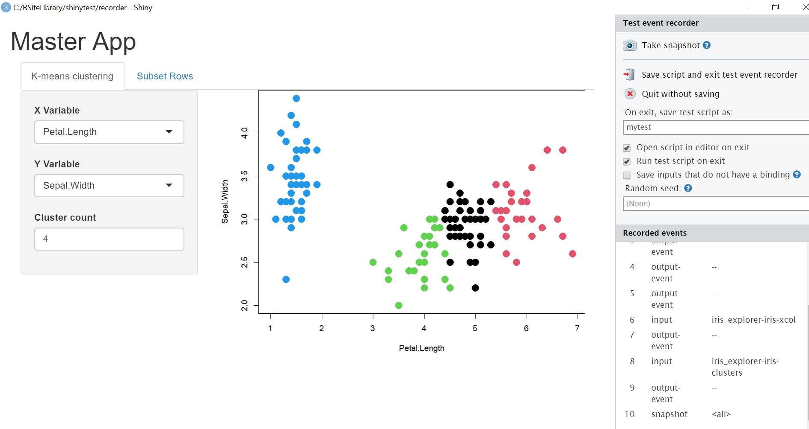

```{r setup, include=FALSE}
source('www/includes.R')
```

## {width=50px} Introduction

In the previous tutorial, we covered how to pass objects between modules to use them in a cohesive app. When writing modules and apps, we might conduct informal tests such as printing outputs to make sure that they work as intended. However, automating these tests helps to ensure that modules and apps continue to work as intended after changes, without the need for manual inspection.

In this tutorial, we will use two approaches for testing shiny applications.

1.  First, we will use the *testthat* package and the `testServer()` function in Shiny to write tests for the stand-alone `iris_cluster` and `subset_rows` modules. 

2. Second, we will use the *shinytest* package to write tests for the overall *shinymgr* framework and app modules.

>  &#128073;&#127998; A "test" is an R script that contains the testing code.

To help lay the groundwork, a directory called "my_shiny_app" and its contents were copied into the tutorial when launched.  Let's have a look:


```{r, echo = FALSE, comment = NA, results = 'hide'}
# get the root path from the tutorial
fp <- paste0(find.package("shinymgr"), "/tutorials/tests/www/my_shiny_app")

file.copy(from = fp, to = tempdir(), recursive = TRUE)
```

```{r, echo = FALSE, comment = NA}

fs::dir_tree(
  path = "my_shiny_app",
  recurse = TRUE
)
```

If you'd like to follow along in a second instance of RStudio, the code below should get you there:

```{r, echo = TRUE, eval = FALSE}
# get the root path from the tutorial
fp <- paste0(
  find.package("shinymgr"), 
  "/tutorials/tests/www/my_shiny_app"
)

# copy the files to your temporary directory
file.copy(from = fp, to = tempdir(), recursive = TRUE)
```

The directory contains the four files we have worked with in previous tutorials ("app.R" is the master app, "iris_explorer.R" is the app module that presents users with a tabbed workflow, where each tab calls the "iris_cluster.R" and "subset_rows.R" modules in turn.

Within the "my_shiny_app" directory, notice a  folder called "tests", which is the focus of this tutorial. Files within this folder are organized as such:

1. The folder "shinytests" will store tests created by the *shinytest* package. Here you will see tests for the app module, "iris_explorer".  The tests are executed by a script called "shinytest.R".
2. The folder "testthat" will store tests created by the package *testthat*. Here you can see two scripts that test the "iris_cluster" and "subset_rows" modules.  We will dive into these scripts shortly.  These tests are executed in bulk by a script called "testhat.R".

Hopefully, this will give you the lay of the land for this tutorial. 

> &#128073;&#127995;Just keep in mind that tests are stored in a directory called "tests", and that we further keep tests created with *testthat* separate from those created with *shinytest*.


We'll begin with module testing via the *testthat* package. 


## Testing with testthat

The *testthat* package is commonly used by R package developers to test functions within their package.  As we'll soon see, the tests are "expectation-based", where the coder identifies target pieces of code (such as a module) and pits the outputs against expected values.  

As you now know, modules consist of a ui function and a server function. However, note that these tests are only written for the server functions of the modules, and ignore any UI, meaning that default values in UI inputs and any JavaScript in the server function aren't recognized. This includes Shiny functions that are wrappers for JavaScript such as `update()`, `showNotification()`, `removeNotification()`, `showModal()`, `hideModal()`, `insertUI()`, `removeUI()`, `appendTab()`, `insertTab()`, and `removeTab()`. Testing JavaScript is out of the scope of this tutorial, but a detailed tutorial can be found here: https://mastering-shiny.org/scaling-testing.html#testing-javascript 

Tests using the *testthat* package all follow the same general format:

```{r, eval = FALSE}
library(testthat)

test_that(
  desc = "A description of the test(s)", 
  code = {
  
    # gather objects created by the function to be tested
    # create new objects that hold expected values
    # code to run the test(s), often using expect_*() functions
    
  }
)
```

We use the `test_that()` function to run the tests, where the first argument is a description of test's intention, and the second argument is a chunk of code that contains test(s) to be run.  An example of the `test_that()` function in action is below (https://r-pkgs.org/testing-basics.html)

```{r}
test_that(
  desc = "multiplication works", 
  code = {
    expect_equal(
      object = 2 * 2, 
      expected = 4
    )
  }
)
```

The code argument uses the `expect_equal()` function to test that 2 times 2 equals four.  The actual comparisons to expected values are conducted using `expect_*()` functions (e.g., `expect_equal()`, `expect_identical()`, `expect_type()`, `expect_length()`, `expect_true()`), which generally take the form:

```{r, eval = FALSE}
expect_*(returnedValue, expectedValue)
```

A full list of `expect*()` functions can be found here: https://testthat.r-lib.org/reference/index.html

When running the tests, if an error occurs, the description of the test currently being run is returned. 

```{r, badmult, exercise = TRUE}
test_that(
  desc = "multiplication works", 
  code = {expect_equal(
    object = 2 * 2, 
    expected = 5
  )}
)
```

As such, we recommend breaking up your tests by topic or category so that the descriptions can be more specific. 

## Testing modules

Because *shinymgr* provides a framework for using and reusing modules, most testing is done at the module level.  However, there are some nuances when testing Shiny modules.  Let's start with a toy example provided in the Shiny helpfiles:

```{r, echo = TRUE}
myModuleServer <- function(id, multiplier, prefix = "I am ") {
  
  moduleServer(id, function(input, output, session) {
    
    myreactive <- reactive({
      input$x * multiplier
    })
    
    output$txt <- renderText({
      paste0(prefix, myreactive())
    })
  })
}
```


Notice that the `myModuleServer()` function follows the format described in previous tutorials in that the function begins with an id, along with additional arguments. Here, our module has two arguments, `multiplier` and `prefix`, where the second has a default value of "I am". 

Then, the `moduleServer()` function does the actual work, with arguments `input`, `output`, and `session`. The `moduleServer()` function body:

- depends on one user input (`input$x`),
- requires the multiplier to be set. 
- creates an intermediate reactive (`myreactive`), and
- updates an output (`output$txt`) reactively.

A test of this module looks like this:

```{r, echo = TRUE}
shiny::testServer(
  app = myModuleServer, 
  args = list(multiplier = 2),
  expr = {
  
    # provide "user" inputs
    session$setInputs(x = 1)
    
    # run tests
    expect_equal(
      object = myreactive(), 
      expected = 2
    )
    expect_equal(
      object = output$txt, 
      expected = "I am 2"
    )
    
    # change the "user" inputs
    session$setInputs(x = 2)
    
    # run tests
    expect_equal(
      object = myreactive(), 
      expected = 4
    )
    expect_equal(
      object = output$txt, 
      expected = "I am 4"
    )
  }
)
```

Let's walk through the code:

- First, the test code begins with a call to Shiny's  `testServer()` function, which simulates the shiny environment, and allows us to control the input values that would normally be entered by a user through the Shiny UI. 
- Second, for the "app" argument, we specify the name of the server function to be tested (`myModuleServer()`).
- Third, for the "args" argument, we pass in arguments required by the module, if necessary. The module's "id" is not required. 
- Fourth, the "expression" is a code block that contains the actual tests.  Notice the use of `session$setInputs()` to simulate user inputs.  Also notice that this example begins by setting `x` to 1, and then changes the value to 2 later in the code.

The `testServer()` function can be wrapped in a `test_that()` call to allow a description of the test. The general format of a test for a shiny server or module looks like: 

```{r, eval = FALSE}
test_that(
  desc = "A description of the test(s)", 
  code = {testServer(
    app = -- server_function_name --, 
    args = -- list of arguments that the module needs --,
    expr = { 
      -- code to run the test(s) --
      -- often using expect_*() functions --
    }
  )}
)
```

In the context of our example, the full test looks like this:

```{r, echo = TRUE}
test_that(
  desc = "Test if multiplication app works", 
  code = {testServer(
    app = myModuleServer, 
    args = list(multiplier = 2),
    expr = {
    
      # provide "user" inputs
      session$setInputs(x = 1)
      
      # run tests
      expect_equal(
        object = myreactive(), 
        expected = 2
      )
      expect_equal(
        object = output$txt, 
        expected = "I am 2"
      )
      
      # change the "user" inputs
      session$setInputs(x = 2)
      
      # run tests
      expect_equal(
        object = myreactive(), 
        expected = 4
      )
      expect_equal(
        object = output$txt, 
        expected = "I am 4"
      )
    } # end of expression
   ) # end of testserver function
  } # end of code
) # end of testthat function
```

Hopefully the test passed!

>  &#128073;&#127995; We recommend that tests are written for modules immediately after they are written while the inputs and outputs are fresh in mind. 

In the next sections, we'll look at the tests for the "iris_cluster" module (with the test script called "test-iris_cluster.R") and for the "subset_data" module (with the test script called "test-subset_data.R").

## The iris_cluster module

For convenience, the "iris_cluster" module is shown below; we will write tests for it in the next section.

```{r, eval = FALSE}
iris_cluster_ui <- function(id){
  # create the module's namespace 
  ns <- NS(id)
  
  # create tagList of inputs
  tagList(
    
    sidebarLayout(
      sidebarPanel(
      
        # add the dropdown for the X variable
        selectInput(
          ns("xcol"),
          label = "X Variable", 
          choices = c(
            "Sepal.Length", 
            "Sepal.Width", 
            "Petal.Length", 
            "Petal.Width"),
          selected = "Sepal.Length"
        ),
        
        # add the dropdown for the Y variable
        selectInput(
          ns("ycol"), 
          label = "Y Variable", 
          choices = c(
            "Sepal.Length", 
            "Sepal.Width", 
            "Petal.Length", 
            "Petal.Width"),
          selected = "Sepal.Width"
        ),
        
        # add input box for the cluster number
        numericInput(
          ns("clusters"), 
          label = "Cluster count", 
          value = 3, 
          min = 1, 
          max = 9
        )
      
      ), # end of sidebarPanel
    
      mainPanel(
        
      # create outputs
        plotOutput(
          ns("plot1")
        )
        
      ) # end of mainPanel
      
    ) # end of sidebarLayout
    
  ) # end of tagList
  
} # end of UI function

iris_cluster_server <- function(id) { 
  
  moduleServer(id, function(input, output, session) {
    
    # combine variables into new data frame
    selectedData <- reactive({
      iris[, c(input$xcol, input$ycol)]
    })
    
    # run kmeans algorithm 
    clusters <- reactive({
      kmeans(
        x = selectedData(), 
        centers = input$clusters
      )
    })
    
    output$plot1 <- renderPlot({
      oldpar <- par('mar')
      par(mar = c(5.1, 4.1, 0, 1))
      p <- plot(
        selectedData(),
        col = clusters()$cluster,
        pch = 20, 
        cex = 3
      )
      par(mar=oldpar)
      p
    })
    
    return(
      reactiveValues(
        returndf = reactive({
          cbind(
            selectedData(), 
            cluster = clusters()$cluster
          )
        })
      )
    )
    
  }) # end of moduleServer function
  
} # end of irisCluster function
```

## Testing the iris_cluster module

The R script called "test-iris_cluster.R" contains the test for the `iris_cluster` module. As we've just seen, this module has no inputs, but it returns a dataframe that includes 3 columns (the iris columns the user selected, and the resulting cluster number).  

>  &#128073;&#127998; If you want to reference an object returned from a server function of a shiny module for testing purposes, you can use the syntax `session$returned$object_name` (see example in "test 3" below). You can include any reactive values created in the server function with the syntax `object()` (see multiple examples below).  

Since this module relies on the k-means clustering function, which is stochastic and can result in different outputs when run multiple times, we must set a seed each time this function is run to ensure reproducibility for testing. Here, we test that the input column names subset the data as expected, and that the kmeans function is running with the input number of clusters. We then test that the returned dataframe is the same as the expected. Finally, we expect the selected data to change when the input column names are changed.


```{r}
library(testthat)
library(shiny)
source(
  system.file(package = "shinymgr", "shinymgr", "modules", "iris_cluster.R")
)

test_that(
  desc = "iris data is clustered and returns 
          the appropriate dataframe", 
  code = {testServer(
    app = iris_cluster_server, 
    expr = {
      
      # load the default module inputs
      data(iris)
    
      # test 1 -----
      # test that iris is being subset correctly
      
      session$setInputs(
        xcol = "Sepal.Length", 
        ycol = "Sepal.Width"
      )
      
      expect_equal(
        object = selectedData(), 
        expected = iris[, c("Sepal.Length", "Sepal.Width")]
      )
    
      # test 2 -----
      # expect the same clusters when kmeans() is run
      
      set.seed(1)
      session$setInputs(clusters = 3)
      
      # create non-reactive testing objects
      set.seed(1)
      expectedCluster <- kmeans(
        x = iris[, c("Sepal.Length", "Sepal.Width")], 
        centers = 3
      )
    
      expect_equal(
        object = clusters()$cluster, 
        expected = expectedCluster$cluster
      )
    
      # test 3 -----
      # expect the same dataframe being returned
      # create non-reactive testing objects
      
      combineddf <- cbind(
        iris[, c("Sepal.Length", "Sepal.Width")], 
        cluster = expectedCluster$cluster
      )
      
      expect_equal(
        object = session$returned$returndf(), 
        expected = combineddf
      )
    
      # test 4 -----
      # expect the selected data to change with different inputs
      
      session$setInputs(
        xcol = "Petal.Length", 
        ycol = "Petal.Width"
      )
      
      expect_equal(
        object = selectedData(), 
        expected = iris[, c("Petal.Length", "Petal.Width")]
      )
  })
})
```

For complex modules, you may wish to split the tests into separate scripts. 

## The subset_rows module

For convenience, the "subset_rows" module is shown below; we will write tests for it in the next section.

```{r, eval = FALSE}
subset_rows_ui <- function(id) {
  ns <- NS(id)
  
  sidebarLayout(
    
    # user inputs are set in the sidebar
    sidebarPanel(
      tagList(
        numericInput(
          inputId = ns("sample_num"),
          label = "Number of rows to sample",
          value = 10,
          min = 1
        ),
        actionButton(
          inputId = ns("resample"),
          label = "Re-sample"
        ),
        br(), 
        reactable::reactableOutput(ns("full_table"))
      )
    ), #end of sidebar panel
    
    # the main panel displays the main output 
    mainPanel(
      tagList(
        h2("These rows were randomly chosen:"),
        reactable::reactableOutput(ns("subset_table"))
      )
    ) #end of main panel
  ) #end of sidebar layout
} #end of ui function

subset_rows_server <- function(id, dataset) {
  moduleServer(id, function(input, output, session) {
    
    # create the reactable object that displays full table
    output$full_table <- reactable::renderReactable({
      reactable::reactable(data = dataset(), rownames = TRUE)
    })
    
    # create a vector of random indices 
    index <- reactive({
      input$resample
      sample(
        x = 1:nrow(dataset()), 
        size = input$sample_num, 
        replace = FALSE)
    })
    
    # create the subset table as a reactable object 
    output$subset_table <- reactable::renderReactable({
      reactable::reactable(dataset()[index(),], rownames = TRUE)
    })
    
    # all modules should return reactive objects
    return(
      reactiveValues(
        subset_data = reactive({
          dataset()[index(),]
        })
      )
    ) # end of return
    
  }) #end moduleServer function
} #end server function
```


## Testing the subset_rows module

The R script called "test-subset_rows.R" contains the testing code for the `subset_rows` module. Remember that subset_rows has an argument named "dataset" (a dataframe).  Here, we will simply call in the iris dataset, and will make it reactive as we want all module inputs and outputs to be reactive so that they can be used anywhere in *shinymgr*.  The user inputs include a numeric input where the number of rows to subset is provided. Another input is the Re-sample button, which permits a new sample to be drawn; it is important to set the seed before to ensure reproducibility.  The function outputs the subsetted dataframe, a reactive value called "subset_data()". 

> &#128073;&#127997;  Note that the unit tests below call intermediate reactive values in the `subset_rows()` module. Specifically, the reactive object named **index()** stores a vector of randomly selected row numbers.  Testing can call any of the module's reactive values, such as **dataset()** and  **index()**.

>  &#128073;&#127998; Note that the unit tests below also call the returned object, **subset_data()**.   If you want to reference an object returned from a server function of a shiny module, you can use the syntax `session$returned$object_name` (see example in tests 2 and 3 below).

For unit testing, we will first test that the randomly subset row indices are the same as what we expect, and that the subset dataframes are the same. Then we test that changing the number of samples to 10 causes the index to change in length. Finally, we check that clicking the resample button causes a re-sample to occur with only 10 rows, and that the resulting dataframes match.

```{r}
library(testthat)
library(shiny)
library(reactable)
source(
  system.file(package = "shinymgr", "shinymgr", "modules", "subset_rows.R")
)

test_that(
  desc = "rows are being randomly subset", 
  code = {testServer(
    app = subset_rows_server,
    args = list(dataset = reactive({iris})),
    expr = {
    
      # collect user inputs and 
      # generate module outputs (subset_data())
      set.seed(1)
      session$setInputs(sample_num = 20)
    
      # create non-reactive test objects
      set.seed(1)
      index_expected <- sample(
        1:nrow(dataset()),
        size = 20,
        replace = FALSE
      )
      
      # test 1 -----
      # expect same random subset of 20 numbers
      expect_equal(
        object = index(),
        expected = index_expected
      )
    
      # test 2 -----
      # expect the same rows to be selected
      expect_equal(
        object = session$returned$subset_data(),
        expected = iris[index_expected,]
      )
      
      # test 3 -----
      # expect a change in sample_num changes length of index 
      session$setInputs(sample_num = 15)
      expect_equal(
        object = nrow(session$returned$subset_data()),
        expected = 15
      )
      
      # test 4 -----
      # Is the re-sample button actually re-sampling the dataset?
      session$setInputs(sample_num = 10)
      set.seed(2)
      index_expected <- sample(
        1:nrow(dataset()),
        size = 10,
        replace = FALSE
      )
      
      set.seed(2)
      session$setInputs(resample = 1)

      expect_equal(
        object = index(),
        expected = index_expected
      )
    }
  )}
)
  
```

## Testing modules in bulk

The script, "testthat.R" can be used to run the tests contained in the "testthat" directory in bulk.  The code is shown below. First, we create a vector that provides all modules tests.  Then, we run *testthat*'s `test_file()` function to run the tests.  You can set the `reporter` argument as desired to control the output.  Below, we use the `check` reporter to simplify the output (see the `test_file()` help page for other options).

```{r}

mod_tests <- list.files(
  path =  paste0(
    find.package("shinymgr"), 
    "/tutorials/tests/www/my_shiny_app/tests/testthat"
  ), 
  full.names = TRUE
)

# run the tests
test_results <- sapply(
  X = mod_tests, 
  FUN = test_file,
  reporter = "check"
)

# look at the structure of the returned results
str(test_results, max.level = 1)
```

As you can see, the `test_file()` results returns a lot of information for each script as a list. 

## Testing with shinytest

Thus far, we have examined the test scripts for two stand-alone modules:  "iris_cluster.R" and "subset_data.R", both stored in the `testthat` directory of the `tests` folder within the main shiny application. The "testthat.R" script runs the tests in bulk.

```{r, echo = FALSE, comment = NA}
fs::dir_tree(
  path = "my_shiny_app",
  recurse = TRUE
)
```

We used the *testthat* approach for creating unit tests of modules.  The "expectation-based" testing of *testhat* is very precise, targeting specific pieces of code and therefore only specific pieces of the broader shiny application.

In contrast, "snapshot-based" testing can test an entire application, and can be done with the package, *shinytest* (available on CRAN). These tests are also stored in the `tests` directory, tucked into a folder called `shinytest`.  Here, you can find the file "test-iris_explorer.R" that pairs with a directory called `test-iris_explorer-expected`, which contains both json files and png files.  The script "shinytest.R" can be used to run these tests in bulk. 

The approach involves 4 basic steps.

1. Creating a test - record user interactions with the app; these interactions are saved in a test script. 
2. Create baseline (expected) snapshots. Run the test script, which will replay the interactions automatically in a browser, taking snapshots along the way for later comparison.
3. Do some new work (modify app, modules, upgrade packages, upgrade R).
4. Re-run the test script and compare the new snapshots with the expected snapshots.

This short video by Winston Cheng of RStudio (Posit) introduces the overall approach (you really must watch this to understand what is going on).

<p><a href="https://posit.co/resources/videos/testing-shiny-applications-with-shinytest-shiny-developers-now-have-tools-for-automated-testing-of-complete-applications/?wvideo=yzdpp2ct4w"></a></p>

<p><a href="https://posit.co/resources/videos/testing-shiny-applications-with-shinytest-shiny-developers-now-have-tools-for-automated-testing-of-complete-applications/?wvideo=yzdpp2ct4w">Testing Shiny applications with Shinytest - Shiny developers now have tools for automated testing of complete applications. - RStudio</a></p>

To see *shinytest* in action, run the `recordTest()` function and point to the directory that holds the app.  (This cannot be done in the tutorial itself or we would demo it here.)  We saved the test script as "test-iris_explorer.R", and tests were run on exit so we can inspect them here.

```{r testrecord, eval = FALSE}
library(shinytest)
recordTest(app = "my_shiny_app")
```

```{r , eval = FALSE, echo = FALSE}
recordTest(app = paste0(tempdir(), "/tests/my_shiny_app"))
```


```{r, echo=FALSE, out.width="100%"}

```

As shown in the file structure above, the *shinytest* scripts and results should be stored in the "tests/shinytest" directory. 

> Storing tests there ensures it works with the runTests() function shiny package (added in shiny 1.5.0), which will run the tests in bulk.

The "test-iris_explorer.R" script within this folder was automatically written as a result of the "recording" made when changing app inputs, and by taking snapshots of the state of the app at specified times.  


```{r, eval = FALSE}
app <- ShinyDriver$new("../../")
app$snapshotInit("test-iris_explorer")

app$setInputs(`iris_explorer-iris-ycol` = "Petal.Length")
app$setInputs(`iris_explorer-iris-clusters` = 4)
app$snapshot()
app$setInputs(`iris_explorer-mainTabSet` = "Subset Rows")
app$setInputs(`iris_explorer-subset-sample_num` = 11)
app$snapshot()
```

The results of recording creates the "expectations", and are saved in the directory "test_iris_explorer-expected".  Let's have a look:

```{r}
list.files(
  path = paste0(tempdir(), "/my_shiny_app/tests/shinytest"),
  full.names = FALSE,
  recursive = TRUE
)
```
There are two sets of json files and png files, one for each snapshot.  The png show a a picture of the app at the time of the snapshot, while the json file is crammed with information about app itself.  Together, these files establish  a benchmark "state of the app" that can be compared to at a later time (after further development of the app).


## Testing shinytests in bulk

Bulk testing can be done by coding the script, "shinytest.R", located in the "tests" directory and will perform tests on all tests within the "shinytest" directory. The code can be very simple, and uses either the `runTests()` function from the *shiny* package or the `testApp()` function from the *shinytest* package.  Here, we illustrate the latter. 

```{r, warning = FALSE, eval = FALSE}
shiny::runTests(appDir = "my_shiny_app")
```

```{r, warning = FALSE, eval = TRUE}
shinytest::testApp(appDir = "my_shiny_app")
```

>&#128073;&#127996; Note, if the above code block executed correctly, it will indicate that the -current snapshots differ from the -expected. Read on to learn why.

When either of these functions are run, the test-iris_explorer.R script is executed, and writes new png and json files to "test-iris_explorer" directory that reflect the current state of the app.

```{r}
## [1] "test-iris_explorer-current/001.json" 
## [2] "test-iris_explorer-current/001.png"  
## [3] "test-iris_explorer-current/002.json" 
## [4] "test-iris_explorer-current/002.png"  
## [5] "test-iris_explorer-expected/001.json"
## [6] "test-iris_explorer-expected/001.png" 
## [7] "test-iris_explorer-expected/002.json"
## [8] "test-iris_explorer-expected/002.png" 
## [9] "test-iris_explorer.R"
```

The current and expected results can then be compared with the `viewTestDiff()` function (which we won't display here as it is best done in interactive mode).

```{r, eval = FALSE}
viewTestDiff("my_shiny_app", interactive = FALSE)
```

As noted above, the -current snapshots differ from the -expected in the contained example. Why would these results differ, considering that we haven't modified the app since initially creating the snapshots? The answer is that elements of our app use random number generation, namely the k-means clustering that occurs in the first module and the subsetting (random sampling) that occurs in the second module. Viewing the test differences interactively would make this apparent. Because random number generators produce different values each time they are called, differences are to be expected, even when all else is identical. But, it can be burdensome to distinguish the expected differences from the unexpected, so finding a way to suppress the expected differences will aide us in properly testing our app.

Recall from an earlier section of this tutorial, when using *testthat*, we seeded the random number generator in the testing script using `set.seed(1)`, however this option isn't available to us with the snapshotting approach of *shinytests*. In this case, it is recommended that you add an output preprocessor, using `shiny::snapshotPreprocessOutput()` to modify an output renderer. A full description of this procedure is outside the scope of this tutorial, but to learn more see the *shinytests* FAQ section here: https://rstudio.github.io/shinytest/articles/faq.html#can-i-modify-the-output-and-input-values-that-are-recorded-in-snapshots-

## Tutorial summary 

In this tutorial we briefly introduced how to write code to test shiny modules with the *testthat* package, and how to to "write" tests of a full application with *shinytest*. 

>&#128073;&#127996;  If you’d like a pdf of this document, use the browser “print” function (right-click, print) to print to pdf. If you want to include quiz questions and R exercises, make sure to provide answers to them before printing.


If you wish to go deeper, these links provide very informative information on shiny modules: 


- For a list of expect_* functions, see https://testthat.r-lib.org/reference/index.html.
- Server function testing with Shiny is at https://shiny.posit.co/r/articles/improve/server-function-testing/.
- The Testing Reactivity - Modules from Mastering Shiny can be found at https://mastering-shiny.org/scaling-testing.html#modules.
- Testing JavaScript functions in Shiny modules is posted at https://mastering-shiny.org/scaling-testing.html#testing-javascript.

And these links provide very informative information on *shinytest*:

- https://posit.co/resources/videos/testing-shiny-applications-with-shinytest-shiny-developers-now-have-tools-for-automated-testing-of-complete-applications/?wvideo=yzdpp2ct4w
- https://shiny.posit.co/r/articles/improve/testing-overview/


## What's next

You're finished!  We've hinted that the *shinymgr* framework relies heavily on modules. It's time to learn the overall *shinymgr* framework. See you there!


```{r, eval = FALSE}
learnr::run_tutorial(
  name = "shinymgr", 
  package = "shinymgr"
)
```

